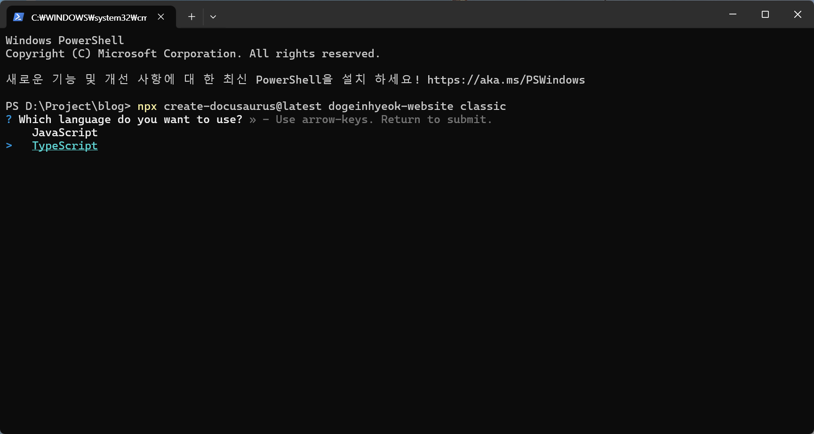
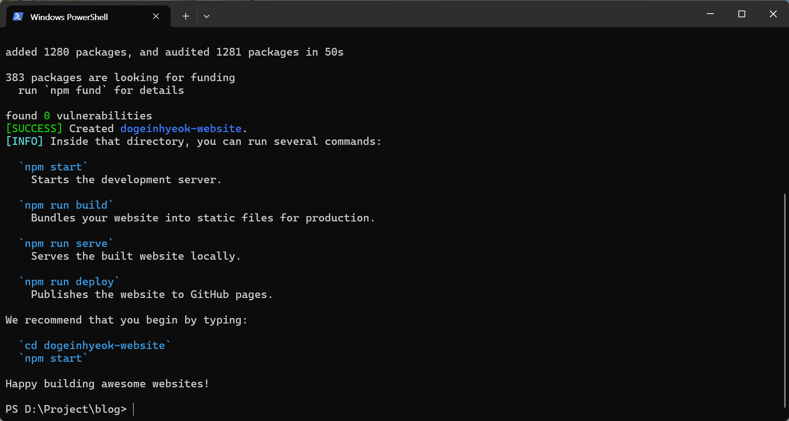
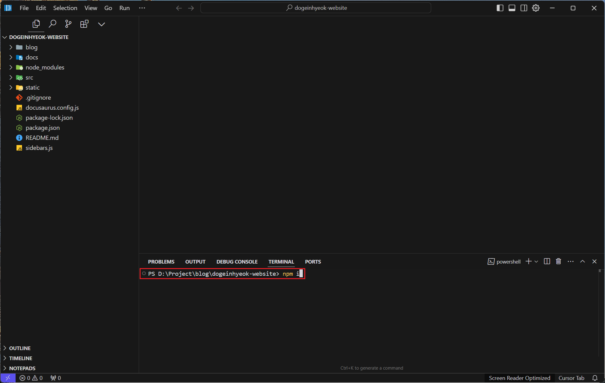
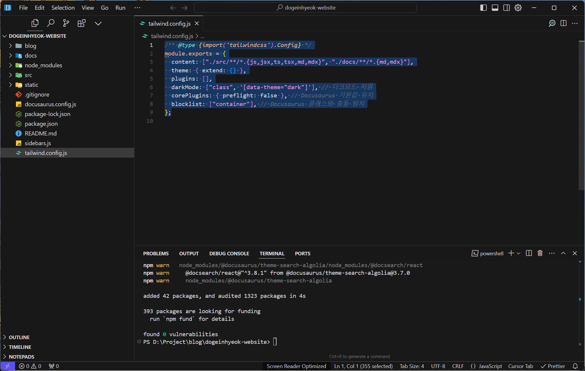
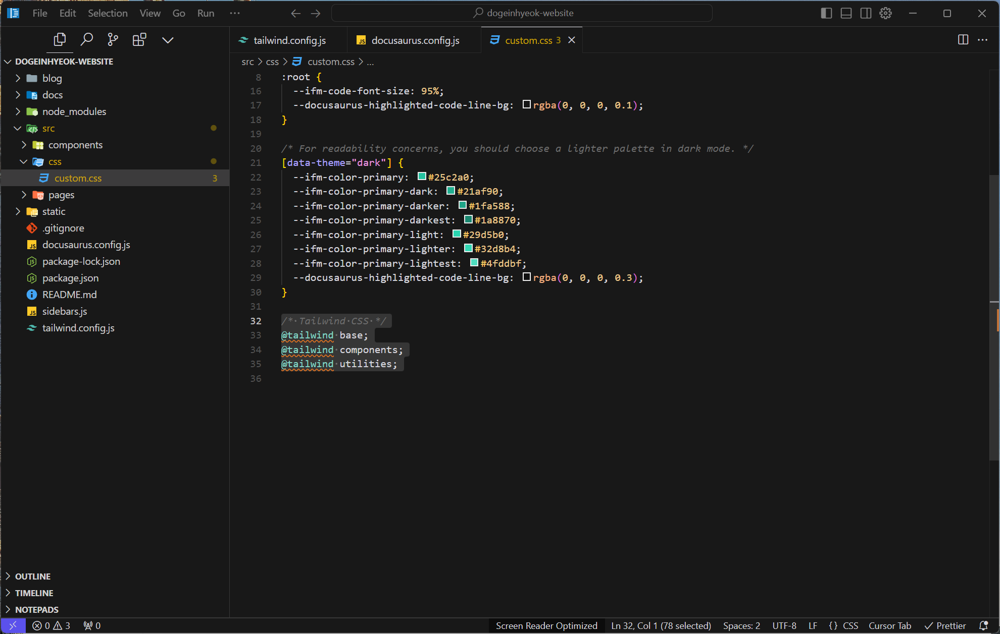
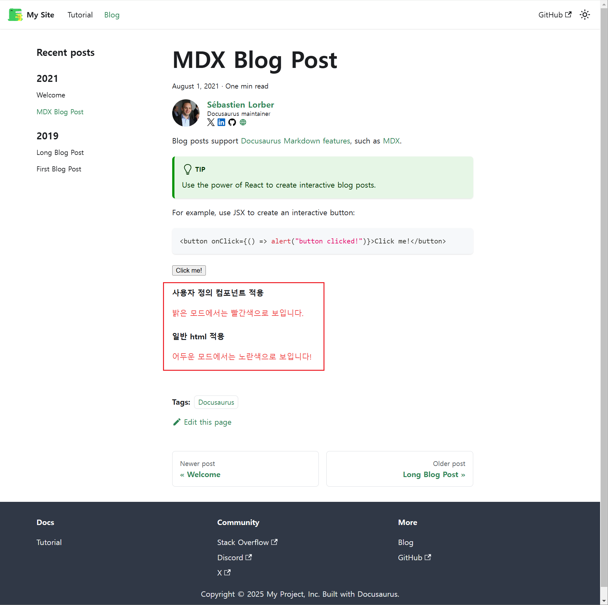
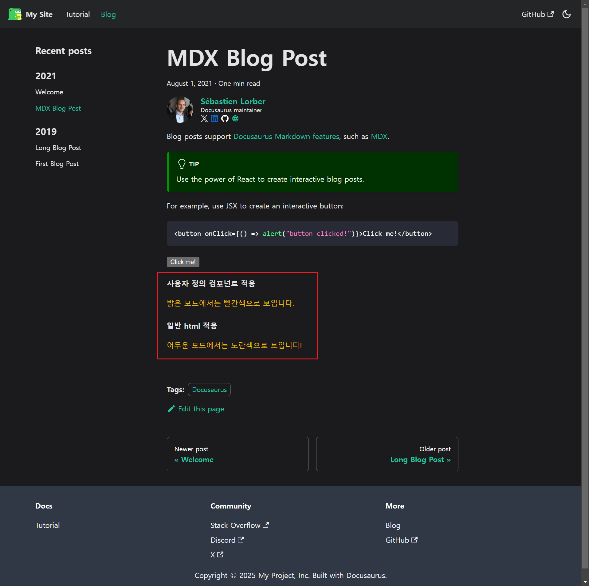

# Docusaurus 기술 블로그 만들기

Docusaurus는 빠르고 간단하게 정적 사이트를 생성할 수 있는 React 기반 정적 사이트 생성기이며, Tailwind CSS는 유틸리티 기반 CSS 프레임워크로 효율적이고 현대적인 스타일링을 제공합니다. 이 두 도구를 결합하면 확장성과 디자인 품질, 그리고 최신 트렌드를 반영한 기술 블로그를 손쉽게 제작할 수 있습니다.

### Docusaurus와 Tailwind CSS 통합의 장점

#### React 기반의 현대적인 설계

- **Docusaurus**는 React를 기반으로 작동하여 현대적인 컴포넌트 구조를 지원합니다.
- React 생태계를 활용해 다양한 외부 서비스와 쉽게 연결할 수 있습니다(예: Google Analytics, Utterances).

#### 확장성과 유연성

- Tailwind CSS의 유틸리티 클래스로 스타일을 쉽고 빠르게 수정하거나 확장할 수 있습니다.
- Docusaurus의 플러그인과 React 컴포넌트로 다양한 기능을 추가하고 사용자 요구사항에 맞출 수 있습니다.

#### 현대적인 디자인

- Tailwind CSS는 반응형, 다크모드, 맞춤 설정이 쉬워 시각적 완성도를 높입니다.
- Docusaurus와 함께 깔끔하고 이해하기 쉬운 인터페이스를 만듭니다.

#### 검색 엔진 최적화 및 성능

- Docusaurus의 검색 엔진 최적화 기능과 Tailwind CSS의 가벼운 구조로 빠른 로딩과 검색 노출을 개선합니다.

## Docusaurus 설치하기

[Installation | Docusaurus](https://docusaurus.io/docs/installation)

원하는 폴더로 이동한 후 Docusaurus를 설치합니다. `create-docusaurus` 명령어로 쉽게 설치할 수 있으며, `my-website` 부분에는 원하는 프로젝트명을 입력하면 됩니다.

```bash
npx create-docusaurus@latest my-website classic
```

설치 과정에서 JavaScript와 TypeScript 버전 중 선택할 수 있습니다. 이 가이드에서는 유지보수 편의성을 고려하여 TypeScript 버전으로 진행하겠습니다.

`Happy building awesome websites!`라고 문구가 뜨면 설치 완료된것입니다.

프로젝트 터미널에서 `npm i` 명령어를 실행하여 필요한 패키지를 설치합니다.

```bash
npm i
```


이후의 모든 작업은 프로젝트의 내부 터미널에서 진행합니다.

## Tailwind CSS 설치하기

[Tailwind CSS Setup | Developer](https://www.onatim.com/docs/tutorial-docusaurus/tailwindcss/)

출처: Tailwind CSS와 Docusaurus 통합 튜토리얼

Tailwind CSS를 프로젝트에 추가하여 스타일 작업을 시작합니다.

```bash
npm install -D tailwindcss postcss autoprefixer
```

이후에는 JavaScript 프로젝트와 TypeScript 프로젝트의 설정 방법이 서로 다릅니다.

## Tailwind CSS 설정하기 - JavaScript편

### Tailwind CSS 설정 파일 추가

다음 명령어로 Tailwind CSS 추가해줍니다.

```bash
npx tailwindcss init
```

### `tailwind.config.js` 설정 파일 수정

Tailwind CSS를 Docusaurus와 연결하려면 다음 설정이 필요합니다:

```jsx
/** @type {import('tailwindcss').Config} */
module.exports = {
  content: [
    "./src/**/*.{js,jsx,ts,tsx,md,mdx}",
    "./docs/**/*.{md,mdx}",
    "./blog/**/*.{md,mdx}",
  ], // tailwind 적용 대상 파일 경로 지정
  theme: { extend: {} }, // tailwind 테마 설정
  plugins: [], // tailwind 플러그인 설정
  darkMode: ["class", '[data-theme="dark"]'], // 다크모드 지원
  corePlugins: { preflight: false }, // Docusaurus 기본값 유지
  blocklist: ["container"], // Docusaurus 클래스와 충돌 방지
};
```



다음 명령어로 output.css 파일이 정상적으로 생성되는지 확인하여 `tailwind.config.js` 설정 파일이 올바르게 적용되었는지 검증합니다.

```bash
npx tailwindcss build -o output.css
```

### Docusaurus 설정 파일에 Tailwind CSS 플러그인 추가

```jsx
import { themes as prismThemes } from "prism-react-renderer";

/** @type {import('@docusaurus/types').Config} */
const config = {
  //...

  plugins: [
    async function tailwindPlugin(context, options) {
      return {
        name: "docusaurus-tailwindcss",
        configurePostCss(postcssOptions) {
          // Tailwind CSS와 AutoPrefixer 추가
          postcssOptions.plugins.push(require("tailwindcss"));
          postcssOptions.plugins.push(require("autoprefixer"));
          return postcssOptions;
        },
      };
    },
  ],

  //...
};

export default config;
```


### Tailwind CSS 불러오기 위한 전역 CSS 파일 수정

`src/css/tailwind.css` 파일에 Tailwind CSS 설정을 추가합니다:

```css
/* Tailwind CSS */
@tailwind base;
@tailwind components;
@tailwind utilities;
```



## Tailwind CSS 설정하기 - TypeScript편

### Tailwind CSS 설정 파일 추가

다음 명령어로 Tailwind CSS 추가해줍니다.

```bash
npx tailwindcss init
```

### `ts-node` 설치

TypeScript로 설정 파일을 작성하려면 `ts-node`를 설치해야 합니다.

```bash
npm install -D ts-node
```

### `tailwind.config.js`를 `tailwind.config.ts`로 변환

설정 파일을 TypeScript로 작성하려면 다음 단계를 따릅니다:

1. `tailwind.config.js` 파일을 `tailwind.config.ts`로 이름 변경.
2. 다음 내용을 추가하여 TypeScript의 타입 지원을 활성화합니다:

```tsx
import { Config } from "tailwindcss";

const config: Config = {
  content: [
    "./src/**/*.{js,jsx,ts,tsx,md,mdx}",
    "./docs/**/*.{md,mdx}",
    "./blog/**/*.{md,mdx}",
  ],
  theme: { extend: {} },
  plugins: [],
  darkMode: ["class", '[data-theme="dark"]'], // 다크모드 지원
  corePlugins: { preflight: false }, // Docusaurus 기본값 유지
  blocklist: ["container"], // Docusaurus 클래스와 충돌 방지
};

export default config;
```


### TypeScript 설정 반영

Tailwind CLI 명령어 실행 시 TypeScript 설정 파일을 사용하려면 아래 명령어를 실행합니다:

```bash
npx tailwindcss -c tailwind.config.ts
```

### 출력 확인

다음 명령어로 Tailwind CSS가 정상적으로 설정되었는지 확인합니다:

```bash
npx tailwindcss build -o output.css
```

### Docusaurus 설정 파일에 Tailwind CSS 플러그인 추가

```jsx
import { themes as prismThemes } from "prism-react-renderer";

/** @type {import('@docusaurus/types').Config} */
const config = {
  //...

  plugins: [
    async function tailwindPlugin(context, options) {
      return {
        name: "docusaurus-tailwindcss",
        configurePostCss(postcssOptions) {
          // Tailwind CSS와 AutoPrefixer 추가
          postcssOptions.plugins.push(require("tailwindcss"));
          postcssOptions.plugins.push(require("autoprefixer"));
          return postcssOptions;
        },
      };
    },
  ],

  //...
};

export default config;
```


## **Tailwind CSS 불러오기 위한 전역 CSS 파일 수정**

`src/css/tailwind.css` 파일에 Tailwind CSS 설정을 추가합니다:

```css
/* Tailwind CSS */
@tailwind base;
@tailwind components;
@tailwind utilities;
```


## **테스트하기**

새로운 MDX 파일을 생성하거나 기본 생성된 `2021-08-01-mdx-blog-post.mdx` 파일에 아래 내용을 추가하여 밝은 모드와 어두운 모드를 테스트해보세요.

```markdown
#### 사용자 정의 컴포넌트 적용

export function Tailwinded() {
return (

<div className="text-red-500 dark:text-yellow-500">
밝은 모드에서는 빨간색으로 보입니다.
</div>
);
}

<Tailwinded />

#### 일반 html 적용

<div className="text-red-500 dark:text-yellow-500">
  어두운 모드에서는 노란색으로 보입니다!
</div>
```






## Utterances 댓글 기능 추가하기

업데이트 예정...

## 구글 AdSense 연동하기

업데이트 예정...

## OpenAPI 연동하기

업데이트 예정...

## Supabase 연동하기

업데이트 예정...

## 웹 페이지 연동하기

업데이트 예정...
