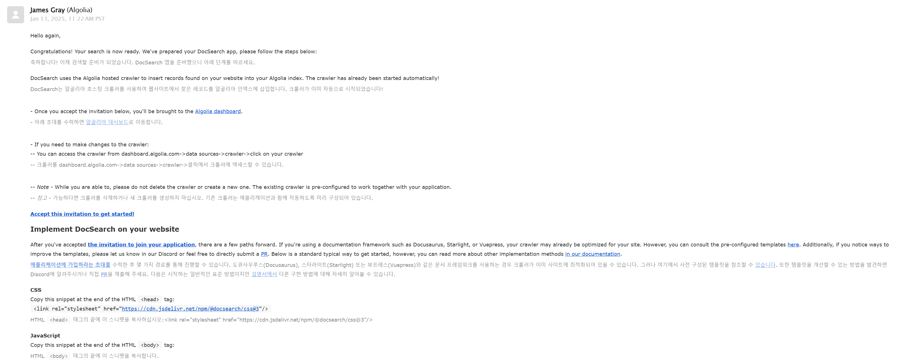
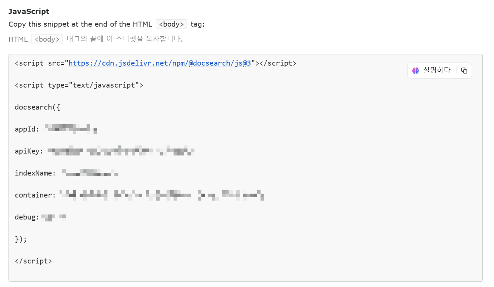
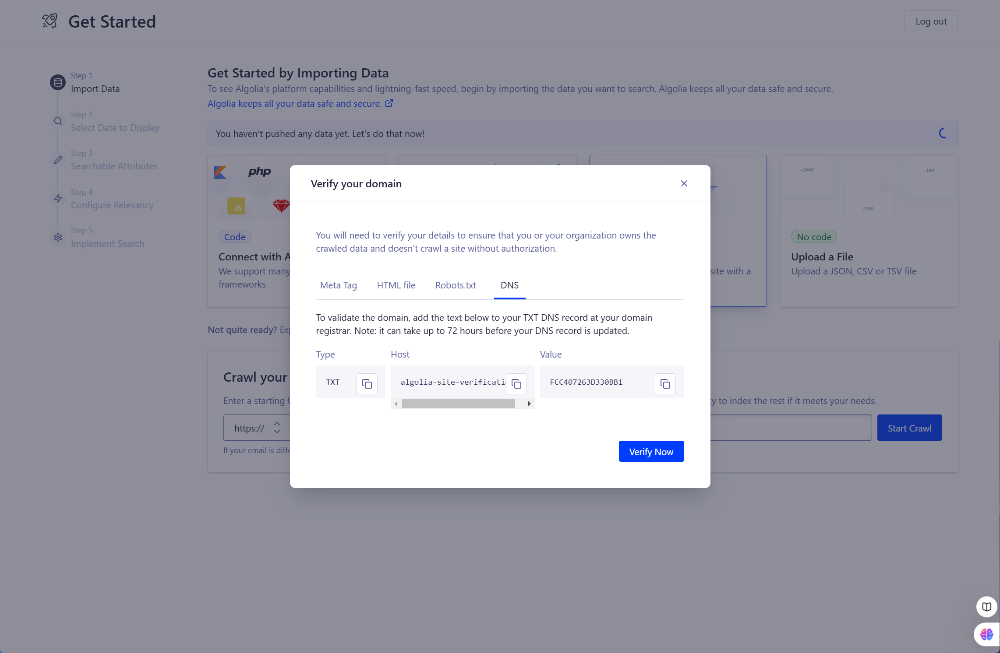
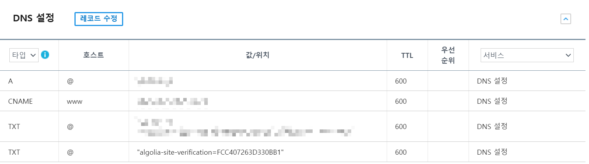

# Algolia 검색 기능 추가하기

Algolia는 검색 기능을 제공하는 서비스로, Docusaurus에서 공식 지원하여 쉽게 검색 기능을 추가할 수 있습니다. 연결 방법은 [공식문서](https://docusaurus.io/ko/docs/next/search)를 참고하세요.

## Algolia 신청하기

[Algolia 홈페이지](https://www.algolia.com/)에 접속하여 회원가입 후 검색기능을 신청합니다.


#### Algolia에게 수락 메시지 받기

Algolia에게 수락 메시지를 받으면 검색기능을 사용할 수 있습니다. 검수에 수일 정도 소요될 수 있습니다.



#### Algolia 환경변수값 등록하기

프로젝트 루트에 `.env` 파일을 생성하고, Algolia 환경변수값을 추가합니다. 아래 설정은 예제일 뿐입니다. 본인의 프로젝트에 맞는 값으로 변경하여 사용하세요. 보통 아래의 사진처럼 메일에 환경변수 값이 적혀있습니다.



```markdown
root/
└── .env
```

아래 코드를 복사하고 메세지로 받은 값을 `.env` 파일에 채워 넣습니다.

```
# Algolia
ALGOLIA_API_KEY=XXX
ALGOLIA_APP_ID=XXX
ALGOLIA_INDEX_NAME=XXX
```

## Algolia 플러그인 설정하기

Docusaurus 프로젝트에 Algolia 플러그인을 설정하는 방법입니다.

#### 플러그인 설치하기

Algolia 플러그인 패키지를 설치합니다.

```bash
npm install --save @docusaurus/theme-search-algolia
```

#### 플러그인 설정하기

`docusaurus.config.ts` 파일에서 Algolia 플러그인을 설정합니다.

```ts
export default {
  title: "My site",
  // ...
  themes: ["@docusaurus/theme-search-algolia"],
  themeConfig: {
    algolia: {
      appId: process.env.ALGOLIA_APP_ID,
      apiKey: process.env.ALGOLIA_API_KEY,
      indexName: process.env.ALGOLIA_INDEX_NAME,
    },
  },
};
```

## Algolia DNS 설정하기

Algolia에서 검색 인덱싱을 제공하기 위해 자신이 사용중인 도메인을 인증해야 합니다. 이를 위해 자신이 사용중인 도메인 등록 기관에서 DNS를 설정해 줍니다.

#### Algolia 대시보드 접속하기

Algolia 홈페이지에서 대시보드로 이동하여 설정할 DNS값을 확인합니다. 복사하여 사용합니다.



#### 내 사이트 DNS 설정하기

복사된 DNS값을 자신이 사용중인 도메인 등록 기관에 설정해 줍니다. 등록 기관에 따라 설정 방법이 다릅니다.



## Search CSS 설정하기

CSS 코드에서 모바일 모드 스타일을 제거하여 Search바와 Navbar Item의 겹침을 방지합니다.

```markdown
src/theme/Navbar/Search
└── .styles.module.css
```

```css
/*
Workaround to avoid rendering empty search container
See https://github.com/facebook/docusaurus/pull/9385
*/
.navbarSearchContainer:empty {
  display: none;
}

.navbarSearchContainer {
  padding: var(--ifm-navbar-item-padding-vertical) var(
      --ifm-navbar-item-padding-horizontal
    );
}
```
