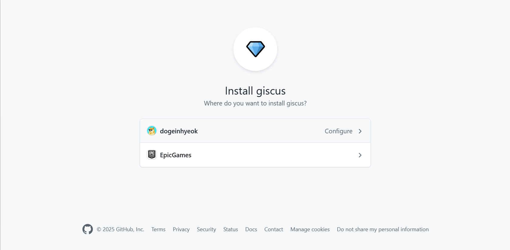
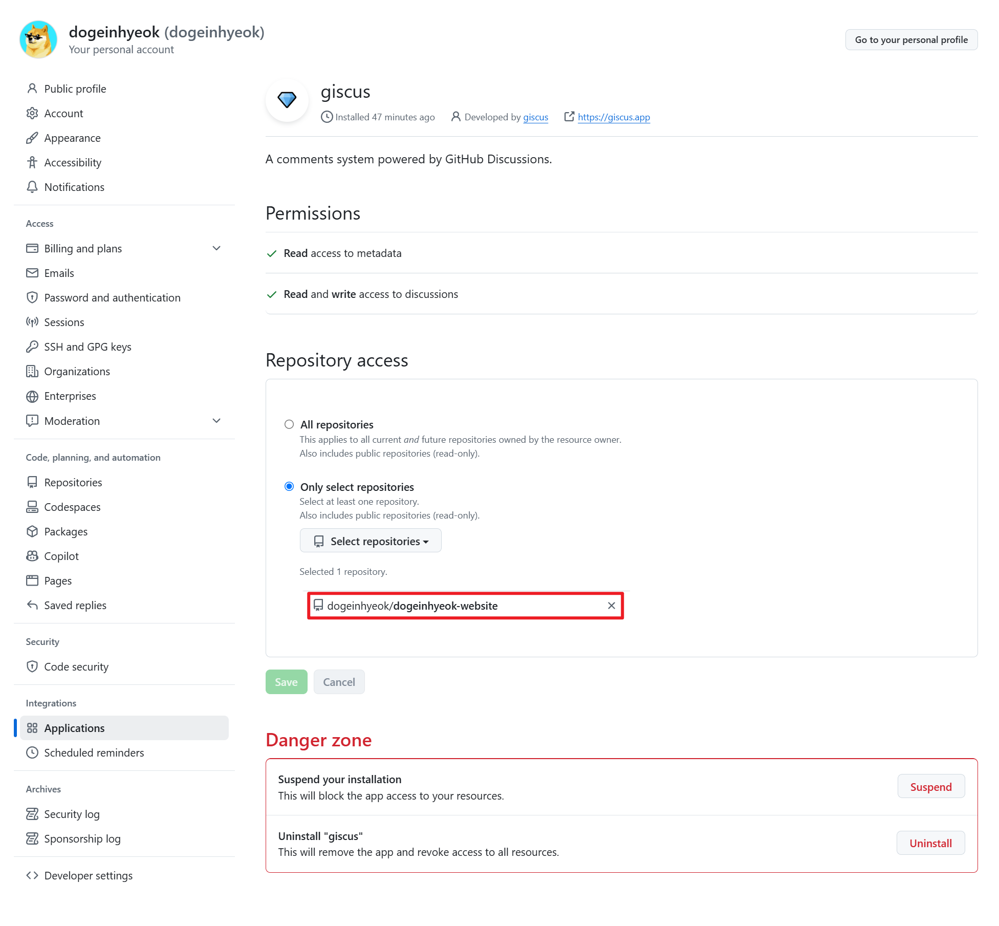
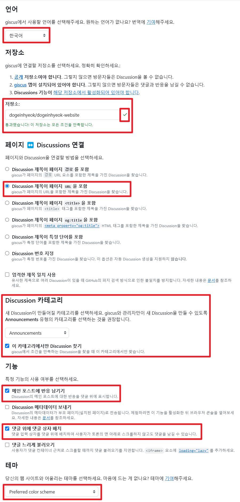
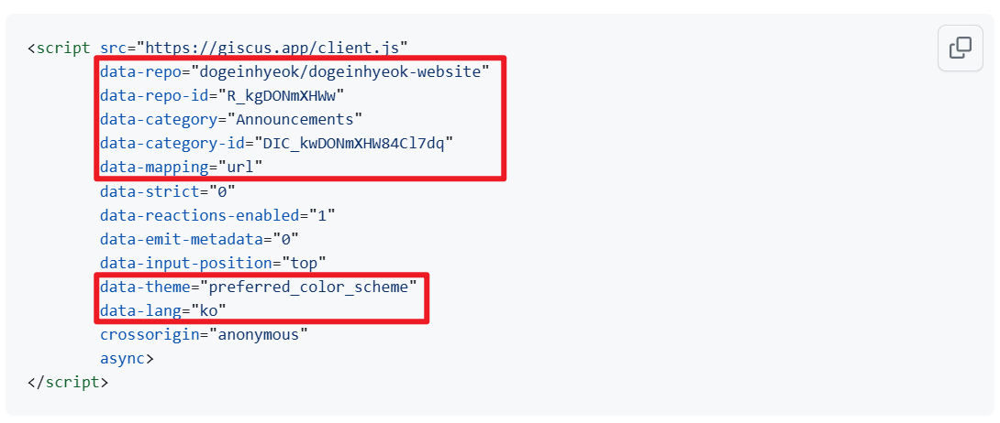
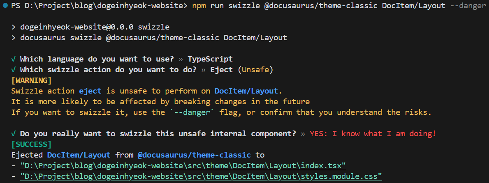
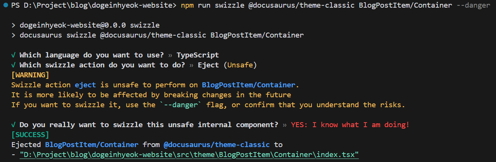
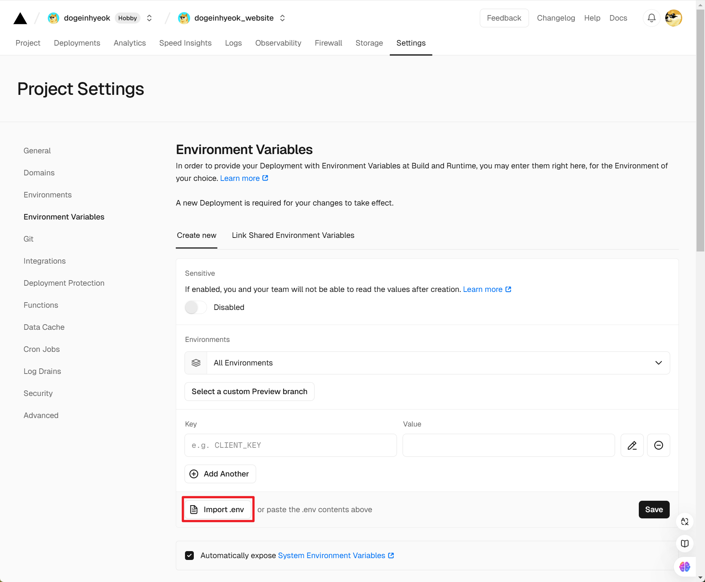
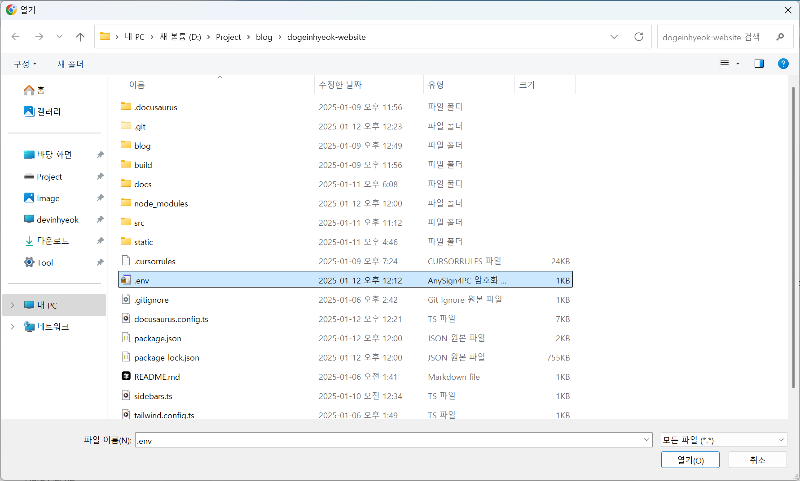

# Giscus 댓글 기능 추가하기

Docusaurus 기반의 블로그에 **Giscus**를 활용해 깔끔한 댓글 기능을 추가해보세요. Giscus는 GitHub Discussions를 기반으로 댓글을 관리할 수 있도록 도와주는 강력한 도구입니다. 아래는 설정 방법과 주요 단계를 소개합니다.

## Giscus란?

**Giscus**는 GitHub Discussions API를 활용하여 웹사이트에 댓글 시스템을 통합할 수 있는 오픈소스 도구입니다.

- **GitHub 계정으로 로그인**: 추가적인 계정 생성 필요 없음.
- **데이터 소유권 보장**: 모든 데이터는 GitHub에 저장됩니다.
- **다크/라이트 모드 지원**: 블로그 테마에 맞게 자동 조정.

## 레포지토리를 퍼블릭으로 전환하기

먼저 Giscus를 사용하려면 배포 중인 Docusaurus 웹사이트 레포지토리를 **퍼블릭**으로 설정해야 합니다.

1. GitHub에서 배포 중인 레포지토리를 열고 **Settings**로 이동합니다.
2. **Change repository visibility**를 선택하고 퍼블릭으로 전환합니다. (이미 퍼블릭이라면 이 단계를 건너뛰어도 됩니다.)

## Giscus앱 설치하기

GitHub에서는 외부 앱을 설치하여 다양한 기능을 확장할 수 있습니다. Giscus 앱을 설치하려면 아래 단계를 따르세요.

#### GitHub Apps - Giscus 설치

[GitHub Apps - Giscus](https://github.com/apps/giscus)에 접속하여 Giscus를 설치합니다.



#### Giscus 앱에 레포지토리 접근 권한 부여

설치후 Giscus 앱에 레포지토리 접근 권한을 부여합니다.



## GiscusComponent 파일 생성하기

`GiscusComponent.tsx` 파일을 생성하고 아래 코드를 삽입합니다.

```markdown
root/src/components
└── GiscusComponent.tsx
```

```tsx
import React, { CSSProperties } from "react"; // CSSProperties 타입을 사용하기 위해 import
import Giscus from "@giscus/react"; // Giscus 댓글 컴포넌트 import
import { useColorMode } from "@docusaurus/theme-common"; // Docusaurus의 색상 모드 훅 import

// GiscusComponent의 props 타입 정의
interface GiscusComponentProps {
  style?: CSSProperties; // 스타일을 커스터마이즈할 수 있는 선택적 prop
}

// GiscusComponent 컴포넌트 정의
const GiscusComponent: React.FC<GiscusComponentProps> = ({ style }) => {
  const { colorMode } = useColorMode(); // 현재 색상 모드 가져오기

  return (
    <Giscus
      repo="[ENTER REPO HERE]" // Giscus가 연결될 GitHub 저장소
      repoId="[ENTER REPO ID HERE]" // 저장소 ID
      category="[ENTER CATEGORY NAME HERE]" // 댓글이 달릴 카테고리
      categoryId="[ENTER CATEGORY ID HERE]" // 카테고리 ID
      mapping="url" // 댓글 매핑 방식
      term="Welcome to @giscus/react component!" // 기본 댓글 주제
      strict="0" // 엄격 모드 설정
      reactionsEnabled="1" // 반응(이모지) 기능 활성화
      emitMetadata="1" // 메타데이터 전송 활성화
      inputPosition="top" // 입력창 위치
      theme={colorMode} // 현재 색상 모드에 따른 테마 설정
      lang="ko" // 언어 설정
    />
  );
};

export default GiscusComponent; // GiscusComponent 컴포넌트 내보내기
```

## GiscusComponent에 값 설정

#### Giscus 앱 대시보드 접속

[giscus.app/ko](https://giscus.app/ko)에 접속합니다.

#### Giscus 설정 값 추출

Giscus 앱 대시보드에서 설정에 필요한 값을 추출할 수 있습니다.



설정 화면에서 아래 항목을 채워넣습니다:

1. **저장소**: Giscus를 연결할 GitHub 저장소를 선택합니다. 모건에 만족하는지 확인합니다.
2. **Discussion 연결 방식**: "Discussion 제목이 페이지 URL을 포함"을 선택합니다.
3. **Discussion 카테고리**: "Announcements"를 추천합니다.
4. **기능**: 메인 포스트에 반응 남기기와 댓글 위에 댓글 상자 배치 기능을 활성화하세요.
5. **테마**: 블로그의 다크/라이트 테마에 맞게 설정합니다.

아래 사진처럼 설정된 값들을 복사해둡니다.



#### GiscusComponent 코드 수정

코드를 수정하여 설정 값을 GiscusComponent에 채워넣습니다.

```tsx
import React, { CSSProperties } from "react"; // CSSProperties 타입을 사용하기 위해 import
import Giscus from "@giscus/react"; // Giscus 댓글 컴포넌트 import
import { useColorMode } from "@docusaurus/theme-common"; // Docusaurus의 색상 모드 훅 import

// GiscusComponent의 props 타입 정의
interface GiscusComponentProps {
  style?: CSSProperties; // 스타일을 커스터마이즈할 수 있는 선택적 prop
}

// GiscusComponent 컴포넌트 정의
const GiscusComponent: React.FC<GiscusComponentProps> = ({ style }) => {
  const { colorMode } = useColorMode(); // 현재 색상 모드 가져오기

  return (
    <div style={style}>
      <Giscus
        repo="dogeinhyeok/dogeinhyeok-website" // Giscus가 연결될 GitHub 저장소
        repoId="R_kgDONmXHWw" // 저장소 ID
        category="Announcements" // 댓글이 달릴 카테고리
        categoryId="DIC_kwDONmXHW84Cl7dq" // 카테고리 ID
        mapping="url" // 댓글 매핑 방식
        term="Welcome to @giscus/react component!" // 기본 댓글 주제
        strict="0" // 엄격 모드 설정
        reactionsEnabled="1" // 반응(이모지) 기능 활성화
        emitMetadata="1" // 메타데이터 전송 활성화
        inputPosition="top" // 입력창 위치
        theme={colorMode} // 현재 색상 모드에 따른 테마 설정
        lang="ko" // 언어 설정
      />
    </div>
  );
};

export default GiscusComponent; // GiscusComponent 컴포넌트 내보내기
```

1.  **`repo`**: Giscus를 연결할 GitHub 저장소 이름 (예: `"사용자명/저장소명"`).
2.  **`repoId`**: GitHub 저장소의 고유 ID로 Discussions와 연결하는 데 필요.
3.  **`category`**: 댓글을 관리할 GitHub Discussions의 카테고리 이름 (예: `"Announcements"`).
4.  **`categoryId`**: 선택한 Discussions 카테고리의 고유 ID.
5.  **`mapping`**: 댓글 연결 방식 (예: `"url"`은 페이지 URL 기준으로 연결).
6.  **`theme`**: 댓글 창의 테마 (예: `"light"`, `"dark"` 또는 동적으로 설정).
7.  **`lang`**: 댓글 창의 언어 (예: `"ko"`는 한국어).

:::info Giscus 설정 값은 보안상 문제가 없습니다

- **공개 정보:** `repo`, `repoId`, `category`, `categoryId`는 GitHub API에서 누구나 확인 가능한 공개 정보입니다.
- **민감한 정보 없음:** Giscus 설정 값에는 API 키나 인증 정보가 포함되지 않아 노출되어도 보안 위협이 없습니다.
- **악용 가능성 없음:** 설정 값이 노출되어도 GitHub Discussions 설정이나 댓글 데이터를 조작할 수 없습니다.
- **GitHub 보안 관리:** Giscus는 댓글 데이터를 GitHub에서 안전하게 관리합니다.

:::

## DocItem-Layout를 Swizzle 하기

Swizzle는 Docusaurus의 기본 테마를 사용자 정의하기 위해 사용하는 기능입니다. 아래는 **DocItem/Layout** 컴포넌트를 Swizzle하여 사용자 정의하는 방법과 선택 옵션에 대한 설명입니다.

#### Swizzle 명령어 실행

```bash
npm run swizzle @docusaurus/theme-classic DocItem/Layout
```

#### 옵션 선택

1. **TypeScript 선택**: TypeScript는 코드의 타입 안정성을 제공하여 작성 및 디버깅을 용이하게 하고, Docusaurus 코드베이스와의 일관성을 유지합니다.
2. **Eject 선택**: Swizzle의 Eject 기능을 사용하면 테마 컴포넌트를 독립적으로 수정하여 기존 테마에 영향을 주지 않고 새로운 스타일이나 기능을 추가할 수 있습니다.



## DocItem-Layout에 GiscusComponent 추가하기

Docusaurus의 **DocItem-Layout**은 각 문서 페이지의 레이아웃을 정의하는 기본 컴포넌트입니다. Giscus 댓글 기능을 추가하려면 **DocItem-Layout**을 수정하여 문서 하단에 댓글 창을 표시할 수 있습니다. 아래는 단계별 설정 방법과 코드 설명입니다.

```markdown
root/src/theme/DocItem/Layout
└── index.tsx
```

Giscus 댓글 창은 문서 하단의 내비게이터 컴포넌트인 `<DocItemPaginator />` 아래에 삽입합니다.

```tsx
import React, { type ReactNode } from "react";
import clsx from "clsx";
import { useWindowSize } from "@docusaurus/theme-common";
import { useDoc } from "@docusaurus/plugin-content-docs/client";
import DocItemPaginator from "@theme/DocItem/Paginator";
import DocVersionBanner from "@theme/DocVersionBanner";
import DocVersionBadge from "@theme/DocVersionBadge";
import DocItemFooter from "@theme/DocItem/Footer";
import DocItemTOCMobile from "@theme/DocItem/TOC/Mobile";
import DocItemTOCDesktop from "@theme/DocItem/TOC/Desktop";
import DocItemContent from "@theme/DocItem/Content";
import DocBreadcrumbs from "@theme/DocBreadcrumbs";
import ContentVisibility from "@theme/ContentVisibility";
import type { Props } from "@theme/DocItem/Layout";
import GiscusComponent from "@site/src/components/GiscusComponent"; // GiscusComponent 컴포넌트 가져오기

import styles from "./styles.module.css";

/**
 * Decide if the toc should be rendered, on mobile or desktop viewports
 */
function useDocTOC() {
  const { frontMatter, toc } = useDoc();
  const windowSize = useWindowSize();

  const hidden = frontMatter.hide_table_of_contents;
  const canRender = !hidden && toc.length > 0;

  const mobile = canRender ? <DocItemTOCMobile /> : undefined;

  const desktop =
    canRender && (windowSize === "desktop" || windowSize === "ssr") ? (
      <DocItemTOCDesktop />
    ) : undefined;

  return {
    hidden,
    mobile,
    desktop,
  };
}

export default function DocItemLayout({ children }: Props): ReactNode {
  const docTOC = useDocTOC();
  const { metadata } = useDoc();
  return (
    <div className="row">
      <div className={clsx("col", !docTOC.hidden && styles.docItemCol)}>
        <ContentVisibility metadata={metadata} />
        <DocVersionBanner />
        <div className={styles.docItemContainer}>
          <article>
            <DocBreadcrumbs />
            <DocVersionBadge />
            {docTOC.mobile}
            <DocItemContent>{children}</DocItemContent>
            <DocItemFooter />
          </article>
          <DocItemPaginator />
          {/* GiscusComponent 추가 */}
          <GiscusComponent style={{ marginTop: "4rem" }} />
        </div>
      </div>
      {docTOC.desktop && <div className="col col--3">{docTOC.desktop}</div>}
    </div>
  );
}
```

## BlogPostItem-Container를 Swizzle 하기

아래는 **BlogPostItem-Container** 컴포넌트를 Swizzle하여 사용자 정의하는 방법과 선택 옵션에 대한 설명입니다.

#### Swizzle 명령어 실행

```bash
npm run swizzle @docusaurus/theme-classic BlogPostItem/Container
```

#### 옵션 선택

1. **TypeScript 선택**: TypeScript는 코드의 타입 안정성을 제공하여 작성 및 디버깅을 용이하게 하고, Docusaurus 코드베이스와의 일관성을 유지합니다.
2. **Eject 선택**: Swizzle의 Eject 기능을 사용하면 테마 컴포넌트를 독립적으로 수정하여 기존 테마에 영향을 주지 않고 새로운 스타일이나 기능을 추가할 수 있습니다.



## BlogPostItem-Container에 GiscusComponent 추가하기

Docusaurus의 **BlogPostItem-Container**는 블로그 게시물의 레이아웃을 정의하는 기본 컴포넌트입니다. Giscus 댓글 기능을 추가하여 각 블로그 게시물 하단에 댓글 창을 표시할 수 있습니다. 아래는 설정 방법과 관련 설명입니다.

```markdown
root/src/theme/DocItem/Layout
└── index.tsx
```

Giscus 댓글 창은 `<article>` 태그 내부의 게시물 콘텐츠 바로 아래에 삽입됩니다. 이 위치는 블로그 게시물의 내용이 끝난 후, 독자들이 바로 댓글을 작성하거나 반응을 남길 수 있도록 자연스럽게 연결됩니다.

```tsx
import React, { type ReactNode } from "react";
import type { Props } from "@theme/BlogPostItem/Container";
import GiscusComponent from "@site/src/components/GiscusComponent"; // GiscusComponent 컴포넌트 가져오기

export default function BlogPostItemContainer({
  children,
  className,
}: Props): ReactNode {
  return (
    <article className={className}>
      {children}
      {/* GiscusComponent 추가 */}
      <GiscusComponent style={{ marginTop: "4rem" }} />
    </article>
  );
}
```

## 환경 변수 설정 (선택)

Giscus 설정 값은 하드코딩해도 문제가 없지만, **일관성**과 **유지보수성**을 위해 [환경변수](https://docusaurus.io/docs/deployment)로 관리하겠습니다. 로컬 개발에서는 `.env` 파일로, 배포 단계에서는 Vercel 대시보드의 환경변수를 사용하면 안전하게 프로젝트를 관리하고 배포할 수 있습니다.

#### 로컬 개발용 환경 변수 파일 설정

프로젝트 루트에 `.env` 파일을 생성하고, Giscus 설정 값을 정의합니다. 아래 설정은 예제일 뿐입니다. 본인의 프로젝트에 맞는 값으로 변경하여 사용하세요.

```markdown
root/
└── .env
```

```
# Giscus 설정
GISCUS_REPO=dogeinhyeok/dogeinhyeok-website
GISCUS_REPO_ID=R_kgDONmXHWw
GISCUS_CATEGORY=Announcements
GISCUS_CATEGORY_ID=DIC_kwDONmXHW84Cl7dq
GISCUS_MAPPING=url
GISCUS_TERM=Welcome to @giscus/react component!
GISCUS_STRICT=0
GISCUS_REACTIONS_ENABLED=1
GISCUS_EMIT_METADATA=1
GISCUS_INPUT_POSITION=top
GISCUS_LANG=ko
```

#### dotenv 패키지를 설치

Node.js 환경에서 `.env` 파일의 값을 읽기 위해 `dotenv` 패키지를 설치합니다:

```bash
npm install --save-dev dotenv
```

#### `docusaurus.config.ts`에서 환경 변수 로드

환경 변수를 Docusaurus 설정 파일에 로드하여 `customFields`를 통해 클라이언트 측에서 접근할 수 있도록 합니다.

```markdown
root/
└── docusaurus.config.ts
```

```tsx
// ...
import "dotenv/config"; // dotenv로 환경 변수 로드

export default {
  //...
  customFields: {
    giscusRepo: process.env.GISCUS_REPO,
    giscusRepoId: process.env.GISCUS_REPO_ID,
    giscusCategory: process.env.GISCUS_CATEGORY,
    giscusCategoryId: process.env.GISCUS_CATEGORY_ID,
    giscusMapping: process.env.GISCUS_MAPPING,
    giscusTerm: process.env.GISCUS_TERM,
    giscusStrict: process.env.GISCUS_STRICT,
    giscusReactionsEnabled: process.env.GISCUS_REACTIONS_ENABLED,
    giscusEmitMetadata: process.env.GISCUS_EMIT_METADATA,
    giscusInputPosition: process.env.GISCUS_INPUT_POSITION,
    giscusLang: process.env.GISCUS_LANG,
  },
  //...
};
```

#### GiscusComponent 코드 수정

`docusaurus.config.ts`에서 로드된 `customFields` 값을 사용하여 Giscus 설정을 적용합니다.

```markdown
root/src/components
└── GiscusComponent.tsx
```

```tsx
import React, { CSSProperties } from "react"; // CSSProperties 타입을 사용하기 위해 import
import Giscus from "@giscus/react"; // Giscus 댓글 컴포넌트 import
import { useColorMode } from "@docusaurus/theme-common"; // Docusaurus의 색상 모드 훅 import
import useDocusaurusContext from "@docusaurus/useDocusaurusContext"; // customFields 로드

// GiscusComponent의 props 타입 정의
interface GiscusComponentProps {
  style?: CSSProperties; // 스타일을 커스터마이즈할 수 있는 선택적 prop
}

// GiscusComponent 컴포넌트 정의
const GiscusComponent: React.FC<GiscusComponentProps> = ({ style }) => {
  const { colorMode } = useColorMode(); // 현재 색상 모드 가져오기

  const { siteConfig } = useDocusaurusContext();
  const {
    giscusRepo,
    giscusRepoId,
    giscusCategory,
    giscusCategoryId,
    giscusMapping,
    giscusTerm,
    giscusStrict,
    giscusReactionsEnabled,
    giscusEmitMetadata,
    giscusInputPosition,
    giscusLang,
  } = siteConfig.customFields; // 환경 변수 로드

  return (
    <div style={style}>
      {/* 컴파일 에러 무시 */}
      <Giscus
        repo={giscusRepo}
        repoId={giscusRepoId}
        category={giscusCategory}
        categoryId={giscusCategoryId}
        mapping={giscusMapping}
        term={giscusTerm}
        strict={giscusStrict}
        reactionsEnabled={giscusReactionsEnabled}
        emitMetadata={giscusEmitMetadata}
        inputPosition={giscusInputPosition}
        theme={colorMode === "dark" ? "dark_dimmed" : "light"}
        lang={giscusLang}
      />
    </div>
  );
};

export default GiscusComponent; // GiscusComponent 컴포넌트 내보내기
```

#### 로컬 실행 후 확인

환경 변수를 설정한 후, 로컬에서 프로젝트를 실행하여 GiscusComponent가 정상적으로 작동하는지 확인합니다. 실행 후 댓글 창이 로드되면 설정이 완료된 것입니다.

#### Vercel 환경 변수 추가 방법

배포 환경에서는 Vercel 대시보드를 사용하여 환경 변수를 관리합니다.

1. Vercel 대시보드에서 배포 중인 프로젝트를 선택합니다.
2. **Settings > Environment Variables**로 이동합니다.
3. **Import .env** 버튼을 클릭하여 로컬에서 설정한 `.env` 파일을 업로드하고, 변수를 추가합니다.





#### 배포 후 확인

수정된 내용을 GitHub에 푸시하고, 배포된 웹사이트에서 Giscus 댓글 컴포넌트가 제대로 동작하는지 확인하세요.
