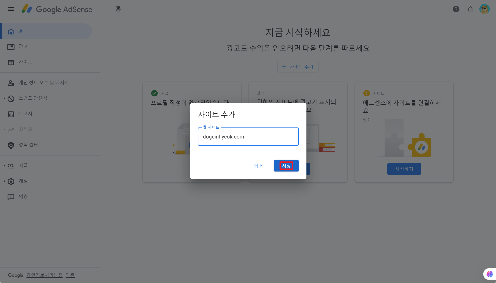

# Google Adsense 추가하기

Google Adsense는 웹사이트에 광고를 표시하여 수익을 창출할 수 있는 강력한 도구입니다. 이번 가이드에서는 Google Adsense를 Docusaurus 프로젝트에 통합하는 과정을 단계별로 설명합니다.

## Google Adsense 계정 설정

먼저 [Google Adsense](https://adsense.google.com/intl/ko_kr/start/) 안내에 따라 계정을 생성하고 기본 프로필 설정을 완료합니다.

## 광고 설정 확정하기

Google Adsense 대시보드에서 자신의 사이트 도메인을 추가하고, 안내에 따라 광고 설정을 확정합니다.





## 사이트 연결 요청하기

Adsense 대시보드에서 "사이트 연결하기" 버튼을 클릭해 사이트 검토를 요청합니다. Google의 승인을 받는 데 약 2~4주가 소요될 수 있습니다.


Google Adsense를 Docusaurus 프로젝트에 통합하기 위해서는 사이트 소유권을 인증해야 합니다. 이를 위해 Docusaurus로 제작된 정적 웹사이트에 환경 변수를 설정하여 소유권을 인증하는 방법을 설명하겠습니다.

## 사이트 소유권 인증하기

사이트 소유권 인증을 위해 Google이 제공하는 코드 값을 Docusaurus 환경에 적용합니다. `GOOGLE_ADSENSE_ID` 값을 `.env` 파일과 Vercel 환경 변수에 추가하여 소유권을 인증합니다.

```markdown
GOOGLE_ADSENSE_ID=ca-pub-544XXXXXXXXXX994
```


#### docusaurus-plugin-google-adsense 플러그인 설치

Google Adsense를 Docusaurus 프로젝트에 통합하기 위해 [docusaurus-plugin-google-adsense](https://github.com/hhk7734/docusaurus-plugin-google-adsense) 플러그인을 설치합니다.

```bash
npm install --save docusaurus-plugin-google-adsense
```

#### docusaurus.config.ts 파일 수정

`docusaurus.config.ts` 파일에서 Google Adsense 설정을 추가합니다.

```tsx
import type { Config } from "@docusaurus/types";

const config: Config = {
  plugins: ["docusaurus-plugin-google-adsense"],
  themeConfig: {
    googleAdsense: {
      dataAdClient: process.env.GOOGLE_ADSENSE_ID,
    },
  },
};

export default config;
```

#### 소유권 확인 요청하기

수정한 코드를 푸시한 후, 아래 페이지에서 소유권 확인 요청 버튼을 클릭합니다. 제 경우에는 이미 소유권이 인증되어 있어, 확인 버튼이 표시되지 않습니다.


#### Google에게 사이트 승인받기

Google로부터 사이트 승인을 받기까지 약 2~4주가 소요될 수 있습니다. 승인이 완료되면 아래 강조된 부분이 완료 상태로 변경됩니다.


## 광고 적용하기

이제 Google Adsense를 Docusaurus 프로젝트에 실제로 통합하여 광고 위젯을 생성하고 적용하는 방법을 알아보겠습니다. 이 과정에서는 승인된 광고 단위를 생성하고, 이를 프로젝트에 통합하여 웹사이트에 광고를 표시하는 방법을 단계별로 설명합니다.

#### 광고 단위 생성하기

사이트가 승인되면 Adsense 대시보드에서 광고 단위를 생성합니다. 광고 단위에는 다양한 타입이 존재하며, 본 가이드에서는 멀티플렉스 광고를 선택해 진행합니다.


#### 환경 변수 추가

생성된 광고 단위의 값을 `.env` 파일에 추가합니다. 배포시에도 적용되기 위해 Vercel 환경 변수에도 추가해줍니다.

```markdown
GOOGLE_ADSENSE_CLIENT_ID=ca-pub-544XXXXXXXXXX994
GOOGLE_ADSENSE_SLOT_ID=16XXXXX070
```


#### docusaurus.config.ts 파일 수정

`docusaurus.config.ts` 파일에 환경 변수를 적용하기 위해, 해당 환경 변수 값을 추가해줍시다. 이를 통해 Google Adsense 설정이 제대로 반영되도록 합니다.

```tsx
// ...
import "dotenv/config"; // dotenv로 환경 변수 로드

// ...

const config: Config = {
  // ...
  customFields: {
    // ...
    googleAdsenseId: process.env.GOOGLE_ADSENSE_ID,
    googleAdsenseSlot: process.env.GOOGLE_ADSENSE_SLOT,
  },
};

export default config;
```

#### react-adsense 플러그인 설치

React에서 Google Adsense 광고를 쉽게 통합할 수 있도록 [react-adsense](https://www.npmjs.com/package/react-adsense) 라이브러리를 설치합니다.

```css
npm install react-adsense
```

#### GoogleAdsenseComponent.tsx 생성

Google Adsense 광고를 렌더링하는 컴포넌트를 생성합니다.

```markdown
src/components/
└── GoogleAdsenseComponent.tsx
```

```tsx
// src/components/GoogleAdsenseComponent.tsx
import React, { CSSProperties } from "react";
import AdSense from "react-adsense";
import useDocusaurusContext from "@docusaurus/useDocusaurusContext";

interface GoogleAdsenseProps {
  style?: CSSProperties; // 스타일을 커스터마이즈할 수 있는 선택적 prop
}

const GoogleAdsenseComponent: React.FC<GoogleAdsenseProps> = ({ style }) => {
  const { siteConfig } = useDocusaurusContext();
  const { googleAdsenseId, googleAdsenseSlot } = siteConfig.customFields;

  return (
    <div style={style}>
      <AdSense.Google
        client={googleAdsenseId}
        slot={googleAdsenseSlot}
        style={{ display: "block" }}
        format="auto"
        responsive="true"
      />
    </div>
  );
};

export default GoogleAdsenseComponent;
```

#### Docs 페이지에 광고 추가

`src/theme/DocItem/Layout` 파일을 수정하여, 문서 하단에 Google Adsense 광고를 추가합니다.

```markdown
src/theme/DocItem/Layout
└── index.tsx
```

```tsx
import React, { type ReactNode } from "react";
import clsx from "clsx";
import { useWindowSize } from "@docusaurus/theme-common";
import { useDoc } from "@docusaurus/plugin-content-docs/client";
import DocItemPaginator from "@theme/DocItem/Paginator";
import DocVersionBanner from "@theme/DocVersionBanner";
import DocVersionBadge from "@theme/DocVersionBadge";
import DocItemFooter from "@theme/DocItem/Footer";
import DocItemTOCMobile from "@theme/DocItem/TOC/Mobile";
import DocItemTOCDesktop from "@theme/DocItem/TOC/Desktop";
import DocItemContent from "@theme/DocItem/Content";
import DocBreadcrumbs from "@theme/DocBreadcrumbs";
import ContentVisibility from "@theme/ContentVisibility";
import type { Props } from "@theme/DocItem/Layout";
import GiscusComponent from "@site/src/components/GiscusComponent"; // GiscusComponent 컴포넌트 가져오기
import GoogleAdsenseComponent from "@site/src/components/GoogleAdsenseComponent"; // GoogleAdsenseComponent 컴포넌트 가져오기
import styles from "./styles.module.css";

/**
 * Decide if the toc should be rendered, on mobile or desktop viewports
 */
function useDocTOC() {
  const { frontMatter, toc } = useDoc();
  const windowSize = useWindowSize();

  const hidden = frontMatter.hide_table_of_contents;
  const canRender = !hidden && toc.length > 0;

  const mobile = canRender ? <DocItemTOCMobile /> : undefined;

  const desktop =
    canRender && (windowSize === "desktop" || windowSize === "ssr") ? (
      <DocItemTOCDesktop />
    ) : undefined;

  return {
    hidden,
    mobile,
    desktop,
  };
}

export default function DocItemLayout({ children }: Props): ReactNode {
  const docTOC = useDocTOC();
  const { metadata } = useDoc();
  return (
    <div className="row">
      <div className={clsx("col", !docTOC.hidden && styles.docItemCol)}>
        <ContentVisibility metadata={metadata} />
        <DocVersionBanner />
        <div className={styles.docItemContainer}>
          <article>
            <DocBreadcrumbs />
            <DocVersionBadge />
            {docTOC.mobile}
            <DocItemContent>{children}</DocItemContent>
            <DocItemFooter />
          </article>
          <DocItemPaginator />
          {/* Google Adsense 추가 */}
          <GoogleAdsenseComponent style={{ marginTop: "4rem" }} />
          {/* GiscusComponent 추가 */}
          <GiscusComponent style={{ marginTop: "4rem" }} />
        </div>
      </div>
      {docTOC.desktop && <div className="col col--3">{docTOC.desktop}</div>}
    </div>
  );
}
```

#### Blog 페이지에 광고 추가

`src/theme/BlogPostItem/Container` 파일을 수정하여, 블로그 하단에 광고를 추가합니다.

```markdown
src/theme/BlogPostItem/Container
└── index.tsx
```

```tsx
import React, { type ReactNode } from "react";
import type { Props } from "@theme/BlogPostItem/Container";
import GiscusComponent from "@site/src/components/GiscusComponent"; // GiscusComponent 컴포넌트 가져오기
import GoogleAdsenseComponent from "@site/src/components/GoogleAdsenseComponent"; // GoogleAdsenseComponent 컴포넌트 가져오기

export default function BlogPostItemContainer({
  children,
  className,
}: Props): ReactNode {
  return (
    <article className={className}>
      {children}
      {/* Google Adsense 추가 */}
      <GoogleAdsenseComponent style={{ marginTop: "4rem" }} />
      {/* GiscusComponent 추가 */}
      <GiscusComponent style={{ marginTop: "4rem" }} />
    </article>
  );
}
```

## 광고 확인 및 디자인 조정

광고가 올바르게 표시되는지 확인하세요. 광고 위치 및 디자인은 사이트 사용자 경험에 따라 조정할 수 있습니다.
