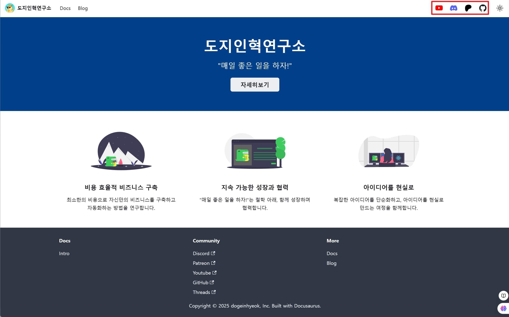

# Navbar 아이콘 추가하기

Docusaurus 네비게이션바(Navbar)에 아이콘형 링크를 추가하여 더 직관적이고 시각적으로 개선된 사용자 경험을 제공하는 방법을 설명합니다. 특히, 다크 모드와 라이트 모드에 따라 아이콘을 동적으로 전환할 수 있도록 구성합니다.



### SVG 파일 준비하기

아이콘은 16px과 24px 크기로 준비하며, 라이트 모드와 다크 모드 각각에 맞는 파일을 제공합니다.

```markdown
root/static/icon/
└── 16px/
├── github.svg
└── github-dark.svg
└── 24px/
├── github.svg
└── github-dark.svg
```

### NavbarItem Swizzle하기

Docusaurus 기본 NavbarItem을 수정하기 위해 Swizzle 명령어를 실행합니다. Swizzle 명령어는 Docusaurus의 기본 컴포넌트를 복사하여 프로젝트 내에서 사용자 정의할 수 있게 합니다.

```bash
npm run swizzle @docusaurus/theme-classic NavbarItem
```

### DefaultNavbarItem 수정하기

기본 `NavbarItem` 컴포넌트를 수정하여 특정 URL(예: GitHub)에 대해 아이콘이 표시되도록 합니다. 이 과정에서 데스크톱용(DefaultNavbarItemDesktop)과 모바일용(DefaultNavbarItemMobile) 컴포넌트를 별도로 정의합니다

```markdown
src/theme/NavbarItem
└── DefaultNavbarItem.tsx
```

```tsx
import React, { type ReactNode } from "react";
import clsx from "clsx";
import NavbarNavLink from "@theme/NavbarItem/NavbarNavLink";
import { useColorMode } from "@docusaurus/theme-common"; // Docusaurus 컬러모드 훅
import type {
  DesktopOrMobileNavBarItemProps,
  Props,
} from "@theme/NavbarItem/DefaultNavbarItem";

// 데스크톱 로고 컴포넌트 예시
function LogoComponentDesktop(props: {
  href: string;
  lightSrc: string;
  darkSrc: string;
}) {
  const { colorMode } = useColorMode(); // 현재 테마 가져오기

  return (
    <a
      href={props.href}
      className="menu__link group hover:bg-transparent" // 그룹 클래스 추가, 배경색 변경 방지
      target="_blank"
      rel="noopener noreferrer"
    >
      
    </a>
  );
}

// 모바일 로고 컴포넌트 예시
function LogoComponentMobile(props: {
  href: string;
  lightSrc: string;
  darkSrc: string;
  label: string;
}) {
  const { colorMode } = useColorMode(); // 현재 테마 가져오기

  return (
    <a
      href={props.href}
      className="menu__link" // 그룹 클래스 추가
      target="_blank"
      rel="noopener noreferrer"
    >
      
      <div>{props.label}</div>
    </a>
  );
}

function DefaultNavbarItemDesktop({
  className,
  isDropdownItem = false,
  ...props
}: DesktopOrMobileNavBarItemProps) {
  // 특정 URL에 대해 데스크탑 로고 렌더링
  if (props.href && props.href.startsWith("https://github.com")) {
    return LogoComponentDesktop({
      href: props.href,
      lightSrc: "/icon/24px/github.svg",
      darkSrc: "/icon/24px/github-dark.svg",
    });
  }

  const element = (
    <NavbarNavLink
      className={clsx(
        isDropdownItem ? "dropdown__link" : "navbar__item navbar__link",
        className
      )}
      isDropdownLink={isDropdownItem}
      {...props}
    />
  );

  if (isDropdownItem) {
    return <li>{element}</li>;
  }

  return element;
}

function DefaultNavbarItemMobile({
  className,
  isDropdownItem,
  ...props
}: DesktopOrMobileNavBarItemProps) {
  // 특정 URL에 대해 모바일 로고 렌더링
  if (props.href && props.href.startsWith("https://github.com")) {
    return LogoComponentMobile({
      href: props.href,
      lightSrc: "/icon/16px/github.svg",
      darkSrc: "/icon/16px/github-dark.svg",
      label: "Github",
    });
  }

  return (
    <li className="menu__list-item">
      <NavbarNavLink className={clsx("menu__link", className)} {...props} />
    </li>
  );
}

export default function DefaultNavbarItem({
  mobile = false,
  position, // Need to destructure position from props so that it doesn't get passed on.
  ...props
}: Props): ReactNode {
  const Comp = mobile ? DefaultNavbarItemMobile : DefaultNavbarItemDesktop;
  return (
    <Comp
      {...props}
      activeClassName={
        props.activeClassName ??
        (mobile ? "menu__link--active" : "navbar__link--active")
      }
    />
  );
}
```

#### LogoComponentDesktop

- 데스크톱 네비게이션바에 아이콘을 렌더링하는 컴포넌트입니다.
- 현재 테마(`colorMode`)에 따라 아이콘 경로를 결정하고, 스타일을 동적으로 설정합니다.
- 아이콘 크기를 `24px`로 지정하며, 네비게이션 요소 간 간격을 위해 `margin`을 추가합니다.

#### LogoComponentMobile

- 모바일 네비게이션바에서 아이콘을 렌더링하는 컴포넌트입니다.
- 아이콘 크기를 `1rem`으로 설정하여 모바일 화면에 적합한 크기를 제공합니다.
- 아이콘과 텍스트("Github")를 함께 표시합니다.

#### DefaultNavbarItemDesktop

- 데스크톱 환경에서 URL이 특정 조건(GitHub URL)을 만족하면 **아이콘 컴포넌트**를 렌더링합니다.
- 조건을 만족하지 않을 경우 기본 `NavbarNavLink`를 렌더링합니다.

#### DefaultNavbarItemMobile

- 모바일 환경에서 URL이 특정 조건(GitHub URL)을 만족하면 **아이콘 컴포넌트**를 렌더링합니다.
- 조건을 만족하지 않을 경우 기본 `NavbarNavLink`를 렌더링합니다.

### Navbar Swizzle하기

Docusaurus에서 NavbarItems와 NavbarColorModeToggle 사이의 간격을 조절하려면, Navbar 관련 컴포넌트를 swizzle하여 커스터마이징할 수 있습니다. Navbar 컴포넌트는 NavbarItems와 NavbarColorModeToggle을 포함하고 있으므로, 이 컴포넌트를 swizzle하여 간격을 조절할 수 있습니다.

```powershell
npm run swizzle @docusaurus/theme-classic Navbar
```

### NavbarContent 컴포넌트 수정

NavbarItems와 NavbarColorModeToggle 사이에 16px의 간격을 추가합니다. width 값을 조정하여 간격을 변경할 수 있습니다.

```markdown
src/theme/Navbar/Content/
└── index.tsx
```

```tsx
import React, { type ReactNode } from "react";
import { useThemeConfig, ErrorCauseBoundary } from "@docusaurus/theme-common";
import {
  splitNavbarItems,
  useNavbarMobileSidebar,
} from "@docusaurus/theme-common/internal";
import NavbarItem, { type Props as NavbarItemConfig } from "@theme/NavbarItem";
import NavbarColorModeToggle from "@theme/Navbar/ColorModeToggle";
import SearchBar from "@theme/SearchBar";
import NavbarMobileSidebarToggle from "@theme/Navbar/MobileSidebar/Toggle";
import NavbarLogo from "@theme/Navbar/Logo";
import NavbarSearch from "@theme/Navbar/Search";
import { useWindowSize } from "@docusaurus/theme-common"; // 윈도우 크기 확인

import styles from "./styles.module.css";

function useNavbarItems() {
  // TODO temporary casting until ThemeConfig type is improved
  return useThemeConfig().navbar.items as NavbarItemConfig[];
}

function NavbarItems({ items }: { items: NavbarItemConfig[] }): ReactNode {
  return (
    <>
      {items.map((item, i) => (
        <ErrorCauseBoundary
          key={i}
          onError={(error) =>
            new Error(
              `A theme navbar item failed to render.
Please double-check the following navbar item (themeConfig.navbar.items) of your Docusaurus config:
${JSON.stringify(item, null, 2)}`,
              { cause: error }
            )
          }
        >
          <NavbarItem {...item} />
        </ErrorCauseBoundary>
      ))}
    </>
  );
}

function NavbarContentLayout({
  left,
  right,
}: {
  left: ReactNode;
  right: ReactNode;
}) {
  return (
    <div className="navbar__inner">
      <div className="navbar__items">{left}</div>
      <div className="navbar__items navbar__items--right">{right}</div>
    </div>
  );
}

export default function NavbarContent(): ReactNode {
  const mobileSidebar = useNavbarMobileSidebar();
  const windowSize = useWindowSize(); // 현재 창 크기
  const isMobile = windowSize === "mobile"; // 모바일 모드인지 확인

  const items = useNavbarItems();
  const [leftItems, rightItems] = splitNavbarItems(items);

  const searchBarItem = items.find((item) => item.type === "search");

  return (
    <NavbarContentLayout
      left={
        // TODO stop hardcoding items?
        <>
          {!mobileSidebar.disabled && <NavbarMobileSidebarToggle />}
          <NavbarLogo />
          <NavbarItems items={leftItems} />
        </>
      }
      right={
        // TODO stop hardcoding items?
        // Ask the user to add the respective navbar items => more flexible
        <>
          <NavbarItems items={rightItems} />
          {!isMobile && <div style={{ width: "8px" }} />} {/* 간격 조절 */}
          <NavbarColorModeToggle className={styles.colorModeToggle} />
          {!isMobile && <div style={{ width: "8px" }} />} {/* 간격 조절 */}
          {!searchBarItem && (
            <NavbarSearch>
              <SearchBar />
            </NavbarSearch>
          )}
        </>
      }
    />
  );
}
```

### NavbarLogo 텍스트 숨기기

`src/theme/Navbar/Logo/index.tsx` 파일에서 모바일 모드일 때 네비게이션 바의 텍스트를 비활성화하려면, `useWindowSize` 훅을 사용하여 모바일 모드를 감지하고, 조건부 렌더링을 통해 텍스트를 숨길 수 있습니다.

```markdown
src/theme/Navbar/Logo/
└── index.tsx
```

```tsx
import React, { type ReactNode } from "react";
import Logo from "@theme/Logo";
import { useWindowSize } from "@docusaurus/theme-common"; // 윈도우 크기 확인

export default function NavbarLogo(): ReactNode {
  const windowSize = useWindowSize(); // 현재 창 크기
  const isMobile = windowSize === "mobile"; // 모바일 모드인지 확인

  return (
    <Logo
      className="navbar__brand"
      imageClassName="navbar__logo"
      titleClassName={`navbar__title text--truncate ${
        isMobile ? "hidden" : ""
      }`} // 모바일 모드에서 텍스트 숨기기
    />
  );
}
```
