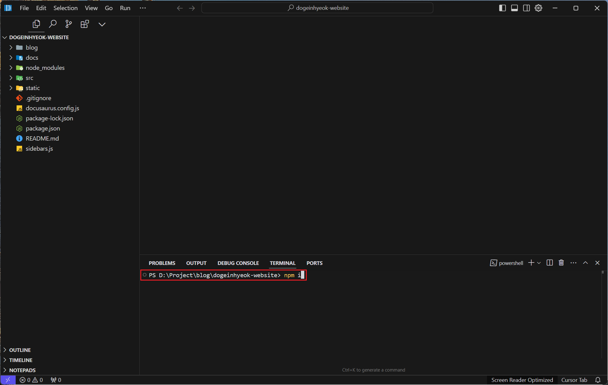

# Docusaurus 시작하기

**Docusaurus**는 React 기반 정적 사이트 생성기로 빠르고 간단하게 정적 사이트를 생성할 수 있습니다. **Tailwind CSS**는 유틸리티 기반 CSS 프레임워크로, 효율적이고 현대적인 스타일링을 제공합니다. 두 도구를 결합하면 **확장성, 디자인 품질, 최신 트렌드**를 반영한 기술 블로그를 손쉽게 제작할 수 있습니다.

## Docusaurus와 Tailwind CSS 통합의 장점

#### React 기반의 현대적인 설계

- Docusaurus는 React 기반으로 동작하여 컴포넌트 구조를 활용할 수 있습니다.
- 다양한 외부 서비스와 쉽게 통합할 수 있습니다. (예: Google Analytics, Giscus)

#### 확장성과 유연성

- Tailwind CSS의 유틸리티 클래스를 사용하여 스타일을 빠르게 수정 및 확장할 수 있습니다.
- Docusaurus의 플러그인과 React 컴포넌트를 활용해 요구사항에 맞게 커스터마이즈 가능합니다.

#### 현대적인 디자인

- Tailwind CSS는 반응형 디자인과 다크 모드, 커스터마이징이 간단합니다.
- Docusaurus와 결합하여 깔끔하고 직관적인 사용자 인터페이스를 제공합니다.

#### 검색 엔진 최적화 및 성능

- Docusaurus는 검색 엔진 최적화(SEO) 기능을 기본 제공합니다.
- Tailwind CSS의 경량 구조는 빠른 로딩 속도를 보장합니다.

## Docusaurus 설치하기 - CLI

Docusaurus를 로컬 환경에서 처음부터 설정하는 [가이드](https://docusaurus.io/docs/installation)입니다.

### 명령어 실행

프로젝트를 설치할 폴더로 이동한 후 아래 명령어를 실행합니다:

```bash
npx create-docusaurus@latest my-website classic
```

#### my-website

원하는 프로젝트명을 입력하세요.

#### classic

블로그 및 문서 사이트에 적합한 기본 템플릿입니다.

### JavaScript/TypeScript 선택

설치 중 JavaScript 또는 TypeScript를 선택할 수 있습니다. 유지보수를 고려해 **TypeScript**를 선택하는 것을 추천합니다.


선택 후 설치가 완료되면 메시지가 `Happy building awesome websites!` 출력됩니다.


### 필수 패키지 설치

설치가 완료되면 아래 명령어로 의존성을 설치하세요.

```bash
npm i
```



### 깃허브 저장소 연결 및 배포

#### Vercel 홈페이지 회원가입

1. [Vercel 홈페이지](https://vercel.com/)에 회원가입하고 로그인합니다.
2. GitHub 계정을 연동합니다.

#### Vercel 프로젝트 생성

Vercel 대시보드에서 "Add New Project"를 클릭합니다.


#### Vercel 프로젝트 설정

GitHub 저장소를 선택하고 프로젝트 이름과 프리셋을 설정합니다.


#### Vercel 프로젝트 설정

Docusaurus (V2)를 선택한 후 **Deploy** 버튼을 클릭합니다.


배포가 완료되면 제공된 URL로 사이트를 확인할 수 있습니다.

## Docusaurus 설치하기 - Vercel

설치와 배포를 한 번에 처리할 수 있는 간단한 방법입니다. 다만 JavaScript 프로젝트에만 사용할 수 있으며, 이후 과정에서는 이 방법을 다루지 않을 예정입니다.

#### Vercel 템플릿 페이지 방문

[Docusaurus 2 템플릿](https://vercel.com/templates/react/docusaurus-2)에 접속합니다.

#### Deploy 버튼 클릭

페이지에서 **"Deploy"** 버튼을 클릭하여 시작합니다.

#### GitHub 계정 연동

Vercel과 GitHub 계정을 연동한 후, 템플릿을 복제할 저장소 이름을 입력합니다.

#### 자동 설치 및 배포

Vercel이 템플릿을 자동으로 설치하고 배포를 진행합니다. 배포가 완료되면 제공된 URL로 사이트를 바로 확인할 수 있습니다.

## 도메인 등록 (선택 사항)

배포 완료 후 기본적으로 Vercel에서 제공하는 무료 서브도메인(예: `https://my-project.vercel.app`)이 생성됩니다. 사용자 정의 도메인을 연결하려면 [공식문서 가이드](https://vercel.com/docs/getting-started-with-vercel/use-existing)를 따르세요.

#### 도메인 구매

원하는 사용자 정의 도메인이 없다면, [가비아](https://www.gabia.com/) 등에서 도메인을 구매하세요.

#### DNS 설정

도메인을 구매한 후, Vercel의 안내에 따라 **A 레코드와 CNAME**을 설정합니다.

1. **A 레코드**: Vercel에서 제공한 IP 주소(`76.76.21.21`)를 입력합니다.
2. **CNAME**: 프로젝트 URL(`your-project.vercel.app`)과 연결합니다.

#### Vercel 도메인 연결

1. [Use an existing domain](https://vercel.com/docs/getting-started-with-vercel/use-existing) 페이지를 방문합니다.
2. 사용하려는 도메인을 입력하고, Vercel의 안내에 따라 설정을 완료하세요.

#### HTTPS 활성화

Vercel은 도메인을 연결하면 **SSL 인증서를 자동 발급**하여 HTTPS를 활성화합니다.

#### 결과 확인

도메인이 등록되면 사용자 정의 URL로 사이트에 접속할 수 있습니다.
