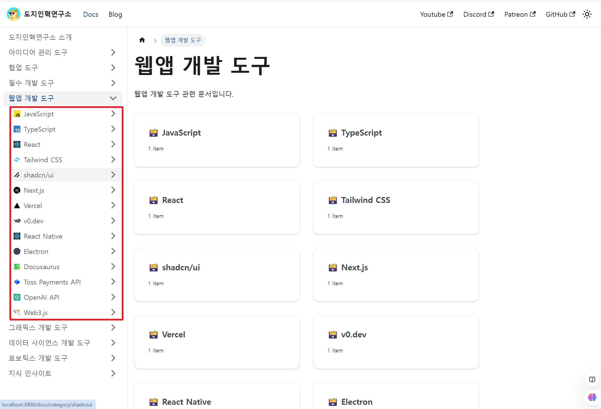

# Sidebar 아이콘 추가하기

사이드바에 아이콘을 추가하면 문서의 구조를 시각적으로 더 쉽게 파악할 수 있습니다. `static/icon/` 디렉토리에 있는 `javascript`, `typescript`, `python` 사이드바에 적용하는 방법을 예시로 설명하겠습니다. 또한 다크 모드와 라이트 모드에 따라 아이콘을 다르게 설정할 수 있도록 하겠습니다.



### SVG 파일 준비하기

```markdown
root/static/icon/
├── javascript.svg
├── javascript-dark.svg
├── typescript.svg
├── typescript-dark.svg
├── python.svg
└── python-dark.svg
```

출력할 이미지를 16x16 크기의 svg 형식으로 static/icon 폴더에 저장합니다.

### CSS 파일에 아이콘 스타일 추가하기

```markdown
root/src/css/
└── custom.css
```

```css
/* 사이드바 아이콘 스타일 */
.menu__link::before {
  width: 1rem;
  height: 1rem;
  padding-right: 0.5rem;
}

/* 16px icons */
.icon-16px-javascript a::before {
  content: url("/icon/16px/javascript.svg");
}

[data-theme="dark"] .icon-16px-javascript a::before {
  content: url("/icon/16px/javascript.svg");
}

.icon-16px-typescript a::before {
  content: url("/icon/16px/typescript.svg");
}

[data-theme="dark"] .icon-16px-typescript a::before {
  content: url("/icon/16px/typescript.svg");
}

.icon-16px-python a::before {
  content: url("/icon/16px/python.svg");
}

[data-theme="dark"] .icon-16px-python a::before {
  content: url("/icon/16px/python.svg");
}
```

#### 사이드바 아이콘 스타일 설정

- `.menu__link::before`를 사용하여 **사이드바 아이콘의 기본 스타일**을 지정합니다.
- `width`와 `height`를 `1rem`으로 설정해 아이콘 크기를 텍스트 크기에 비례하도록 조정합니다.
- `padding-right`를 통해 아이콘과 텍스트 사이의 간격을 설정하여 가독성을 높입니다.

#### 16px 아이콘 스타일 지정

- `.icon-16px-[SVG 파일명] a::before` 형식을 사용해 **SVG 파일별 아이콘**을 지정합니다.
- `content` 속성을 사용해 해당 언어의 **SVG 아이콘 경로**를 설정합니다.
- `[data-theme="dark"]`를 활용해 다크 모드일 때 동일하거나 다른 아이콘을 설정할 수 있습니다.

### 문서 및 카테고리 파일 준비하기

```markdown
root/docs/
└── typescript/ # 타입스크립트 관련 문서 폴더
├── typescript.md # "타입스크립트 시작하기" 문서
└── _category_.json # 타입스크립트 카테고리 설정
```

#### docs/

Docusaurus 문서가 포함된 기본 디렉토리입니다.

#### typescript/

이 폴더에는 타입스크립트 관련 문서(`typescript.md`)와 카테고리 설정 파일(`_category_.json`)이 포함됩니다.

#### _category_.json

해당 폴더가 사이드바에서 어떻게 표시될지 정의합니다. (예: 사이드바의 이름 및 우선 순위을 설정합니다.)

### 카테고리 파일에 적용하기

특정 문서 폴더에 `_category_.json` 파일을 추가하여 해당 카테고리의 속성을 설정할 수 있습니다. 아래는 예제입니다:

```markdown
{ 
"label": "타입스크립트", 
"position": 2, 
"className": "icon-16px-typescript"
}
```

#### label

카테고리 이름을 설정합니다. 사이드바에 표시되는 텍스트입니다. (`"타입스크립트"`)

#### position

사이드바에서 카테고리의 순서를 지정합니다. 숫자가 작을수록 상위에 표시됩니다. (`2`)

#### className

CSS에서 정의된 클래스 이름을 설정합니다. 이 클래스는 `custom.css` 파일에서 정의된 스타일을 참조합니다. (`"icon-16px-typescript"`)

### 문서에 아이콘 적용하기

사이드바에 로고를 적용하려면 관련 MD/MDX 파일의 메타데이터를 수정합니다. 예를 들어, 아래와 같이 설정할 수 있습니다.

```markdown
---
sidebar_position: 1
sidebar_label: 타입스크립트 시작하기
sidebar_class_name: icon-16px-typescript
---
```

#### sidebar_position

사이드바 항목의 위치를 지정합니다. 숫자가 작을수록 상위에 위치합니다. (`1`)

#### sidebar_label

사이드바에 표시될 항목의 이름을 설정합니다. (`"타입스크립트 시작하기"`)

#### sidebar_class_name

해당 항목에 적용할 CSS 클래스 이름을 설정합니다. 이 클래스는 `custom.css` 파일에서 정의된 스타일을 참조합니다. (`"icon-16px-typescript"`)
