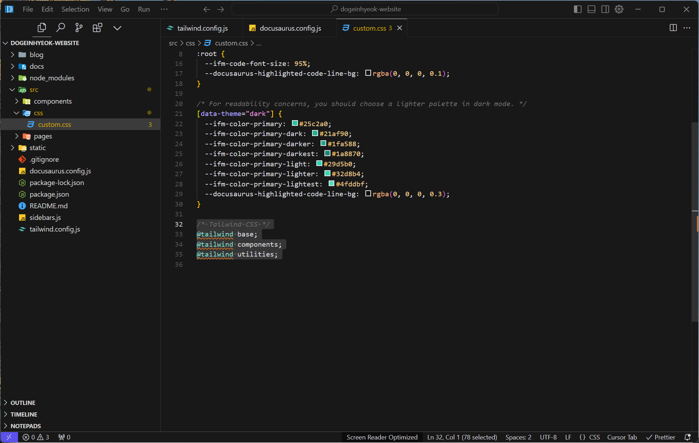
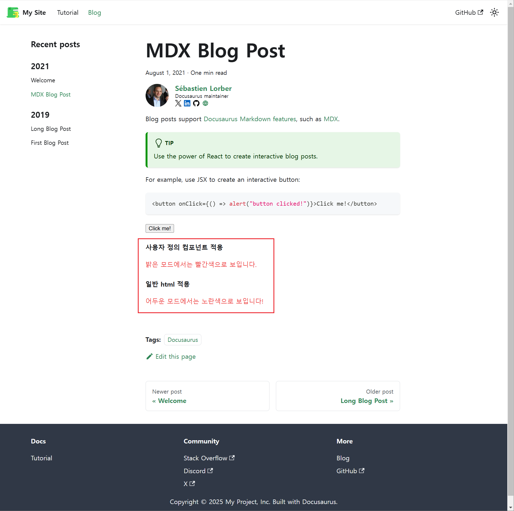
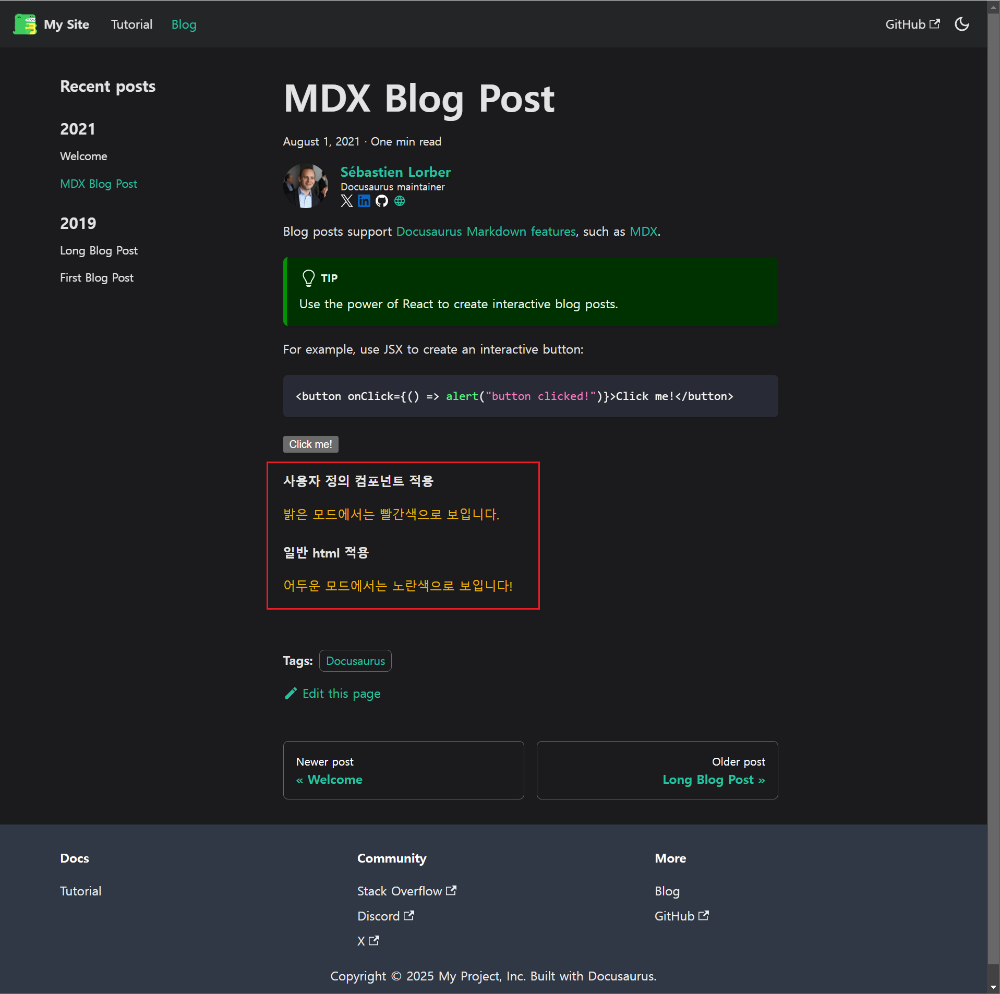

# Tailwind CSS 추가하기

Tailwind CSS를 Docusaurus에 추가하면, 유틸리티 클래스 기반의 스타일링을 통해 빠르고 효율적인 디자인 작업이 가능합니다. 이를 통해 프로젝트의 확장성과 유지보수성을 높일 수 있습니다. 아래 명령어를 사용하여 Tailwind CSS를 설치하고, 프로젝트 설정은 JavaScript 및 TypeScript 버전으로 나뉩니다. 필요한 버전을 선택하여 진행하세요.

```bash
npm install -D tailwindcss postcss autoprefixer
```

## Tailwind CSS 설정하기 - JavaScript편

이 가이드는 **JavaScript** 환경에서 Tailwind CSS를 설정하는 방법을 다룹니다. 아래 단계들을 따르면, JavaScript 프로젝트에 Tailwind CSS를 손쉽게 통합할 수 있습니다.

#### Tailwind CSS 설정 파일 추가

다음 명령어로 Tailwind CSS 추가해줍니다.

```bash
npx tailwindcss init
```

#### tailwind.config.js 설정 파일 수정

Tailwind CSS를 Docusaurus와 연결하려면 생성된 `tailwind.config.js` 파일을 다음과 같이 수정해야 합니다.

```jsx
/** @type {import('tailwindcss').Config} */
module.exports = {
  content: [
    "./src/**/*.{js,jsx,ts,tsx,md,mdx}",
    "./docs/**/*.{md,mdx}",
    "./blog/**/*.{md,mdx}",
  ], // tailwind 적용 대상 파일 경로 지정
  theme: { extend: {} }, // tailwind 테마 설정
  plugins: [], // tailwind 플러그인 설정
  darkMode: ["class", '[data-theme="dark"]'], // 다크모드 지원
  corePlugins: { preflight: false }, // Docusaurus 기본값 유지
  blocklist: ["container"], // Docusaurus 클래스와 충돌 방지
};
```


추가적으로 다음 명령어로 `output.css` 파일 생성 여부를 통해 `tailwind.config.js` 설정 파일이 올바르게 적용되었는지 확인할 수 있습니다.

```bash
npx tailwindcss build -o output.css
```

#### Docusaurus 설정 파일에 Tailwind CSS 플러그인 추가

Tailwind CSS와 AutoPrefixer를 PostCSS 설정에 추가하면, **Tailwind CSS**의 유틸리티 클래스가 프로젝트 전반에 걸쳐 적용되며, **AutoPrefixer**는 다양한 브라우저에서 CSS 호환성을 자동으로 처리합니다.

```jsx
import { themes as prismThemes } from "prism-react-renderer";

/** @type {import('@docusaurus/types').Config} */
const config = {
  //...

  plugins: [
    async function tailwindPlugin(context, options) {
      return {
        name: "docusaurus-tailwindcss",
        configurePostCss(postcssOptions) {
          // Tailwind CSS와 AutoPrefixer 추가
          postcssOptions.plugins.push(require("tailwindcss"));
          postcssOptions.plugins.push(require("autoprefixer"));
          return postcssOptions;
        },
      };
    },
  ],

  //...
};

export default config;
```


#### Tailwind CSS 불러오기 위한 전역 CSS 파일 수정

`src/css/tailwind.css` 파일에 Tailwind CSS 설정을 추가합니다:

```css
/* Tailwind CSS */
@tailwind base;
@tailwind components;
@tailwind utilities;
```


## Tailwind CSS 설정하기 - TypeScript편

이 가이드는 **TypeScript** 환경에서 Tailwind CSS를 설정하는 방법을 다룹니다. 아래 단계들을 따르면, **TypeScript** 프로젝트에 Tailwind CSS를 손쉽게 통합할 수 있습니다.

#### Tailwind CSS 설정 파일 추가

다음 명령어로 Tailwind CSS 추가해줍니다.

```bash
npx tailwindcss init
```

#### ts-node 설치

TypeScript로 설정 파일을 작성하려면 `ts-node`를 설치해야 합니다.

```bash
npm install -D ts-node
```

#### tailwind.config.js를 tailwind.config.ts로 변환

설정 파일을 TypeScript로 작성하려면 다음 단계를 따릅니다:

1. `tailwind.config.js` 파일을 `tailwind.config.ts`로 이름 변경.
2. 다음 내용을 추가하여 TypeScript의 타입 지원을 활성화합니다:

```tsx
import { Config } from "tailwindcss";

const config: Config = {
  content: [
    "./src/**/*.{js,jsx,ts,tsx,md,mdx}",
    "./docs/**/*.{md,mdx}",
    "./blog/**/*.{md,mdx}",
  ],
  theme: { extend: {} },
  plugins: [],
  darkMode: ["class", '[data-theme="dark"]'], // 다크모드 지원
  corePlugins: { preflight: false }, // Docusaurus 기본값 유지
  blocklist: ["container"], // Docusaurus 클래스와 충돌 방지
};

export default config;
```


#### TypeScript 설정 반영

Tailwind CLI 명령어 실행 시 TypeScript 설정 파일을 사용하려면 아래 명령어를 실행합니다:

```bash
npx tailwindcss -c tailwind.config.ts
```

#### 출력 확인

다음 명령어로 Tailwind CSS가 정상적으로 설정되었는지 확인합니다:

```bash
npx tailwindcss build -o output.css
```

#### Docusaurus 설정 파일에 Tailwind CSS 플러그인 추가

```jsx
import { themes as prismThemes } from "prism-react-renderer";

/** @type {import('@docusaurus/types').Config} */
const config = {
  //...

  plugins: [
    async function tailwindPlugin(context, options) {
      return {
        name: "docusaurus-tailwindcss",
        configurePostCss(postcssOptions) {
          // Tailwind CSS와 AutoPrefixer 추가
          postcssOptions.plugins.push(require("tailwindcss"));
          postcssOptions.plugins.push(require("autoprefixer"));
          return postcssOptions;
        },
      };
    },
  ],

  //...
};

export default config;
```


#### Tailwind CSS 불러오기 위한 전역 CSS 파일 수정

`src/css/tailwind.css` 파일에 Tailwind CSS 설정을 추가합니다:

```css
/* Tailwind CSS */
@tailwind base;
@tailwind components;
@tailwind utilities;
```



## MDX 파일에서 Tailwind CSS 테스트하기

새로운 MDX 파일을 생성하거나 기본 생성된 `2021-08-01-mdx-blog-post.mdx` 파일에 아래 내용을 추가하여 밝은 모드와 어두운 모드를 테스트해보세요.

```tsx
#### 사용자 정의 컴포넌트 적용

export function Tailwinded() {
  return (
    <div className="text-red-500 dark:text-yellow-500">
      밝은 모드에서는 빨간색으로 보입니다.
    </div>
  );
}

<Tailwinded />

#### 일반 html 적용

<div className="text-red-500 dark:text-yellow-500">
  어두운 모드에서는 노란색으로 보입니다!
</div>
```

#### 사용자 정의 컴포넌트 적용

export function Tailwinded() {
  return (
    <div className="text-red-500 dark:text-yellow-500">
      밝은 모드에서는 빨간색으로 보입니다.
    </div>
  );
}

<Tailwinded />

#### 일반 html 적용

<div className="text-red-500 dark:text-yellow-500">
  어두운 모드에서는 노란색으로 보입니다!
</div>





