# Analytics 및 SEO 최적화

Analytics 및 SEO 최적화는 웹사이트의 가시성을 높이고 사용자 경험을 개선하기 위해 필수적입니다. 이를 통해 더 많은 방문자를 유치하고, 검색 엔진에서의 순위를 향상시킬 수 있습니다.

## Analytics 설정

Analytics는 웹사이트의 방문자 수를 측정하고 분석하는 데 사용됩니다. 이를 통해 웹사이트의 트래픽과 사용자 행동을 이해하고, 최적화할 수 있습니다.

### Vercel Analytics 연결하기

Vercel Analytics는 Vercel 플랫폼에서 제공하는 웹사이트 분석 도구로, 웹사이트의 성능과 사용자 행동을 모니터링할 수 있도록 도와줍니다.

#### 플러그인 설치

먼저, [Vercel Analytics](https://docusaurus.io/docs/api/plugins/@docusaurus/plugin-vercel-analytics) 플러그인을 설치해야 합니다. 다음 명령어 중 하나를 사용하여 설치할 수 있습니다:

```bash
npm install --save @docusaurus/plugin-vercel-analytics
```

#### 플러그인 설정

**`docusaurus.config.ts`** 파일에 플러그인을 추가합니다:

```ts
export default {
  plugins: [
    [
      "vercel-analytics",
      {
        debug: true,
        mode: "auto",
      },
    ],
  ],
};
```

### Google Analytics 연결하기

#### Google Analytics 계정 생성하기

[Google Analytics](https://analytics.google.com/)에 접속하고 안내에 따라 Google Analytics 계정을 생성합니다.

#### 데이터 스트림 생성하기

데이터 스트림을 생성합니다.

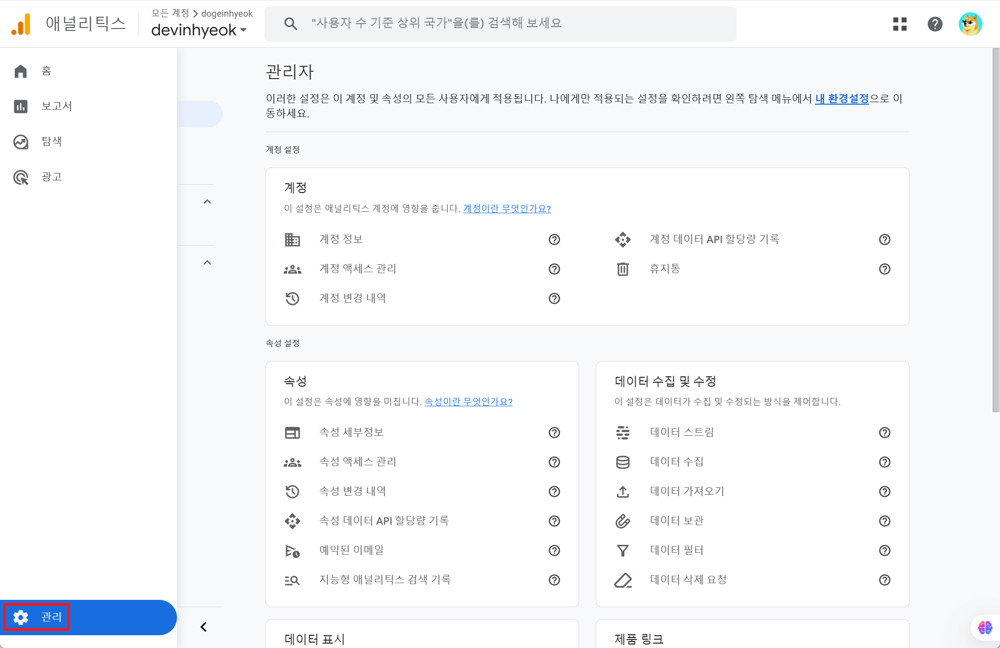

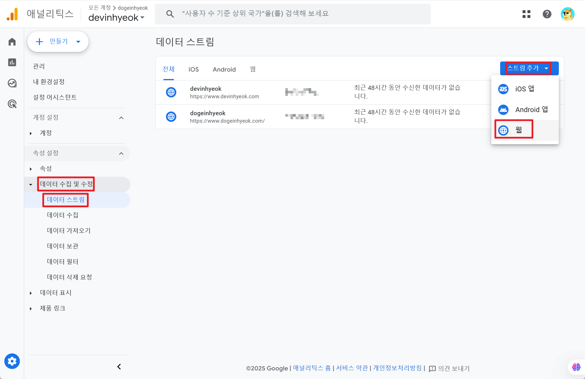

#### 플러그인 설치하기

[plugin-google-gtag](https://docusaurus.io/docs/api/plugins/@docusaurus/plugin-google-gtag) 플러그인은 Docusaurus 사이트에 Google Analytics를 설정하는 데 사용됩니다. 터미널에서 다음 명령어를 실행하여 설치합니다.

```bash
npm install --save @docusaurus/plugin-google-gtag
```

데이터 스트림에서 추적ID값을 복사해 사용합니다.

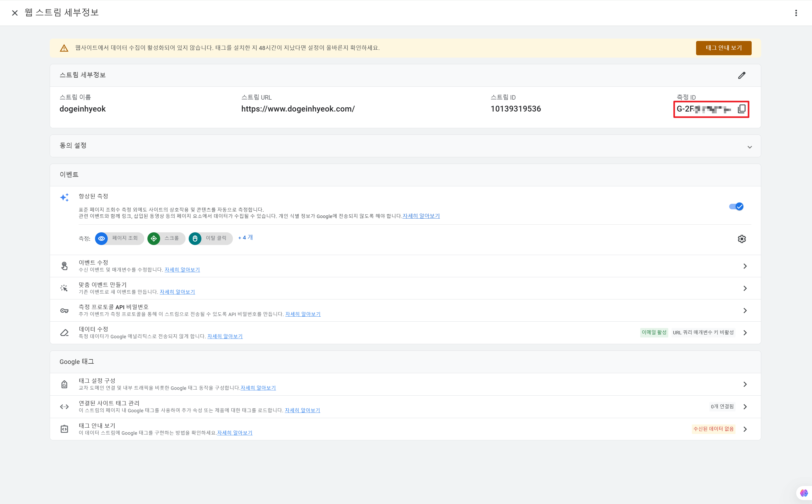

**`docusaurus.config.ts`** 코드를 수정하여 추적ID값을 설정합니다. trackingID 값은 복사해둔 추적ID값을 사용합니다.

```tsx
module.exports = {
  presets: [
    [
      "classic",
      {
        // ...
        gtag: {
          trackingID: "G-999X9XX9XX",
          anonymizeIP: true,
        },
      } satisfies Preset.Options,
    ],
  ],
};
```

#### 환경 변수로 추가하기

.env 파일에 환경 변수를 추가합니다.

```
G_ANALYTICS_ID=G-999X9XX9XX
```

#### docusaurus.config.ts 파일 수정

docusaurus.config.ts 파일에서 환경 변수를 사용하도록 수정합니다.

```ts
import "dotenv/config"; // dotenv로 환경 변수 로드

// ... 기존 코드 ...

presets: [
  [
    "classic",
    {
      // ...
      gtag: {
        trackingID: process.env.G_ANALYTICS_ID, // 환경 변수 사용
        anonymizeIP: true,
      },
    } satisfies Preset.Options,
  ],
],
```

## SEO 설정

SEO는 검색 엔진 최적화(Search Engine Optimization)의 약자로, 웹사이트의 검색 엔진 순위를 향상시키는 데 사용됩니다. 이를 통해 웹사이트가 더 높은 순위로 노출될 수 있습니다.

### Robots.txt 파일 추가하기

`static/robots.txt` 파일을 생성하고 내용을 추가하여 모든 검색 엔진이 사이트의 모든 페이지를 크롤링할 수 있도록 설정합니다.

```txt
User-agent: *
Disallow:
```

### Google Search Console 연결하기

Google Search Console의 주요 기능은 웹사이트의 검색 노출 순위를 개선하는 데 있습니다. 이를 통해 웹사이트의 검색 트래픽과 성능을 모니터링하고, 검색 엔진 최적화를 위한 유용한 데이터를 제공하여 검색 결과에서 더 높은 순위에 오를 수 있도록 돕습니다.

#### 환경 변수로 추가하기

[Google Search Console](https://search.google.com/search-console/about)에 접속하고 본인의 도메인을 검색합니다.

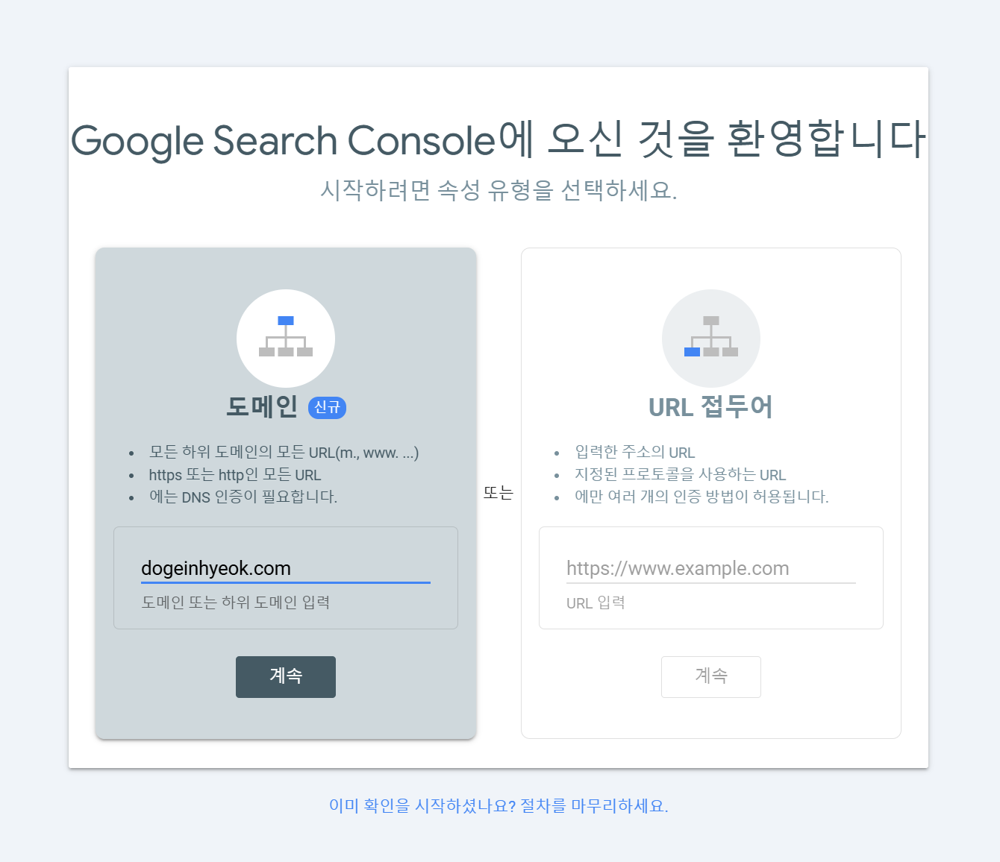

#### 도메인 DNS 레코드 설정하기

Google Search Console에서 DNS 설정값을 복사해둡니다.

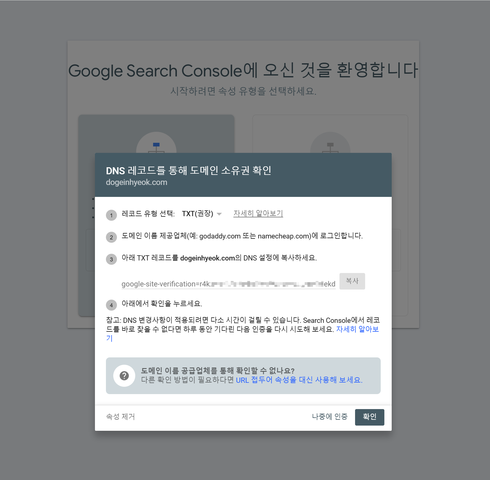

현재 사용하고 있는 도메인 제공 업체에서 복사해준 DNS 설정값을 입력하여 설정해줍니다.

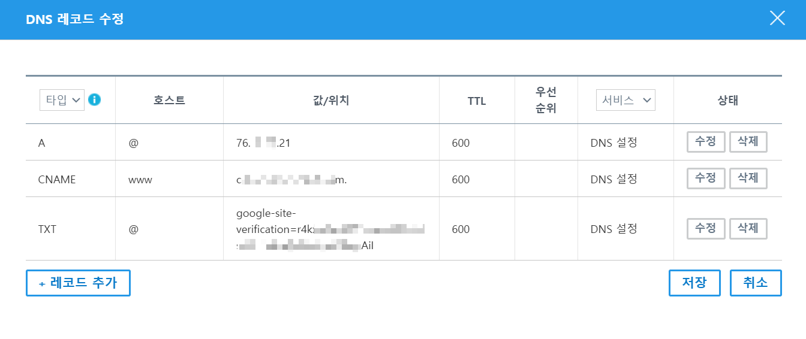

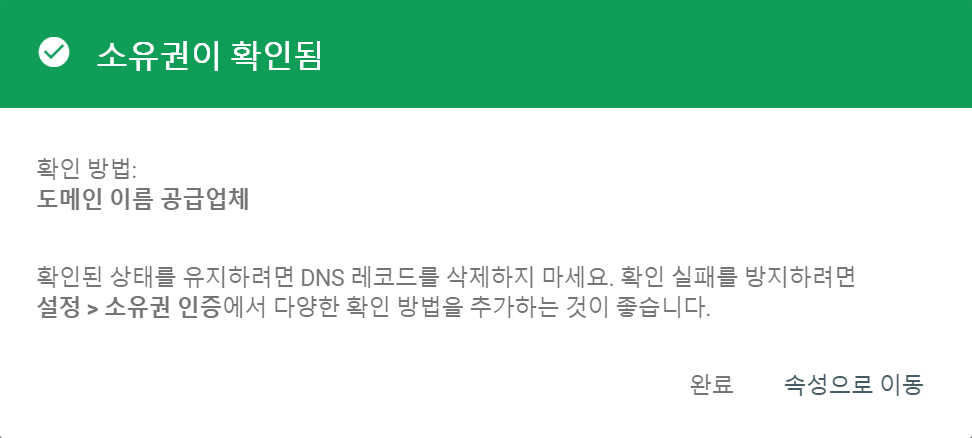

#### Google Analytics와 Google Search Console 연결

Google Search Console을 Google Analytics와 연결하여 추가적인 데이터를 확인할 수 있습니다.

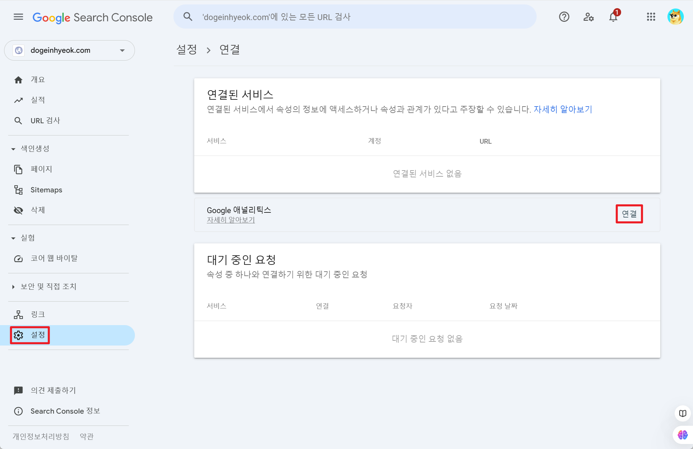

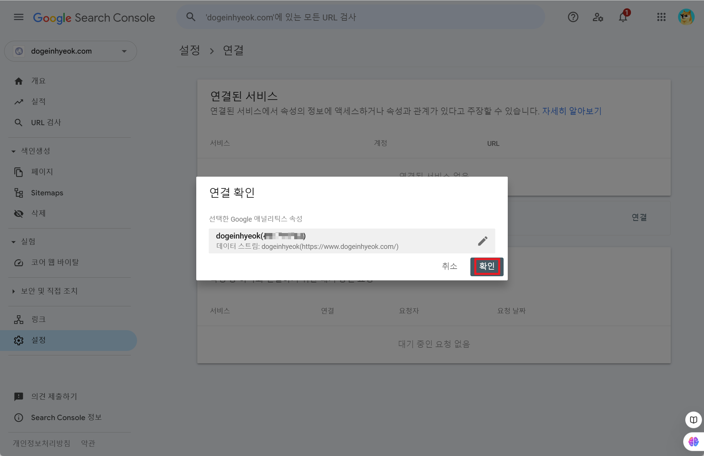

### Naver Search Advisor 연결하기

Naver Search Advisor는 네이버 검색 엔진에서 웹사이트의 가시성을 높이기 위한 도구입니다. 이를 통해 웹사이트의 검색 노출을 모니터링하고 최적화하여, 네이버 검색 결과에서 더 높은 순위에 오를 수 있도록 지원합니다.

#### Naver Search Advisor Console에 접속하기

[Naver Search Advisor Console](https://searchadvisor.naver.com/console/board)에 접속하여 소유권 확인을 위한 콘텐츠 값을 복사해둡니다.

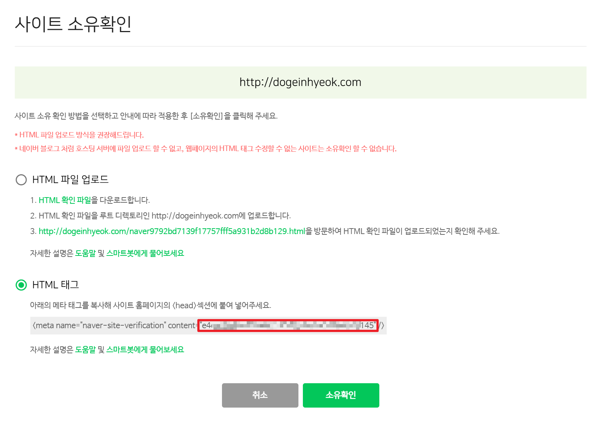

#### 콘텐츠값 환경 변수로 추가하기

복사해둔 콘텐츠 값을 .env 파일 환경 변수로 추가합니다.

```markdown
NAVER_SEARCH_ADVISOR_ID=e4d93bxxxxxxxxxxxxxxxx1629b02d046fc8195145
```

#### docusaurus.config.ts 파일 수정

`docusaurus.config.ts` 파일에서 환경 변수를 사용하도록 수정합니다.

```tsx
import type { Config } from "@docusaurus/types";

const config: Config = {
  plugins: ["docusaurus-plugin-google-adsense"],
  themeConfig: {
    // ... 기존 themeConfig 설정
    metadata: [
      {
        name: "naver-site-verification",
        content: process.env.NAVER_SEARCH_ADVISOR_ID,
      },
    ],
  },
};

export default config;
```

#### Naver Search Advisor Console에 소유확인하기

수정한 코드를 푸쉬하고 소유권 확인합니다.

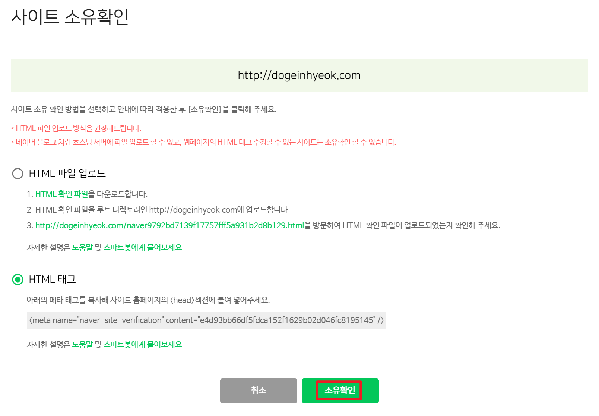

사이트 목록에 자신의 사이트가 표시되고 아래 사진과 같은 메시지가 뜨면 소유권 확인이 완료된 것입니다.

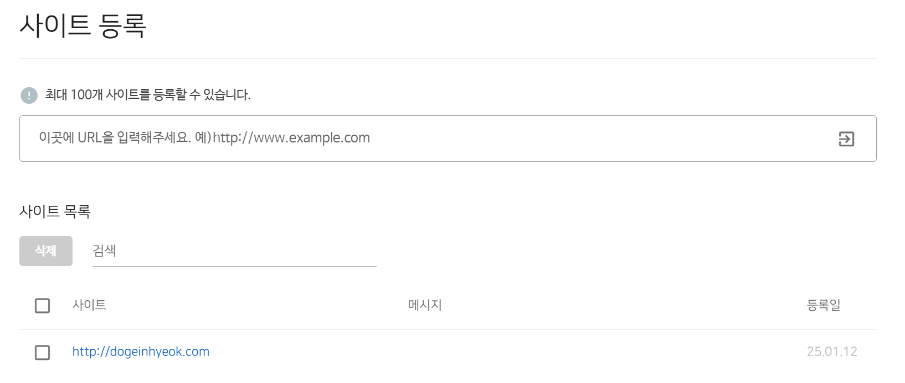

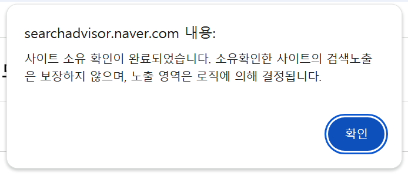
